# Learning Hub - Complete AWS Architecture (36 Microservices)

## Overview

This document presents the complete AWS architecture for the Learning Hub platform with **36 enterprise-grade microservices** deployed on Amazon EKS.

---

## Complete Architecture Diagram

```mermaid
graph TB
    subgraph Internet ["Internet / Users"]
        Users["👥 Users<br/>(Students, Instructors, Admins)"]
    end

    subgraph CloudFront ["AWS CloudFront CDN"]
        CF["CloudFront Distribution<br/>Global Edge Locations<br/>- Static Assets<br/>- Media Streaming<br/>- DDoS Protection"]
    end

    subgraph WAF ["AWS WAF + Shield"]
        WAFLayer["AWS WAF<br/>- OWASP Top 10<br/>- Rate Limiting<br/>- Geo Blocking<br/><br/>AWS Shield Standard"]
    end

    subgraph LoadBalancing ["Application Load Balancer"]
        ALB["Application Load Balancer<br/>- SSL Termination<br/>- Path-based Routing<br/>- Health Checks<br/>- Multi-AZ"]
    end

    subgraph VPC ["VPC: 10.0.0.0/16"]
        
        subgraph PublicSubnets ["Public Subnets (Multi-AZ)"]
            NAT["NAT Gateway<br/>(Multi-AZ)"]
        end

        subgraph PrivateSubnets ["Private Subnets (10.0.10.0/24, 10.0.20.0/24, 10.0.30.0/24)"]
            
            subgraph EKS ["Amazon EKS Cluster - learning-hub-prod"]
                
                subgraph APIGatewayPod ["API Gateway"]
                    APIGW["API Gateway<br/>ClusterIP: 10.100.0.1<br/>DNS: api-gateway.backend-prod.svc.cluster.local<br/>Port: 3000<br/>- Authentication<br/>- Rate Limiting<br/>- Request Routing"]
                end

                subgraph LearningCore ["🎓 Learning Core Services (15)"]
                    UserSvc["User Service<br/>ClusterIP: 10.100.1.1<br/>DNS: user-service.backend-prod.svc.cluster.local<br/>Port: 3001"]
                    
                    AuthSvc["Auth Service<br/>ClusterIP: 10.100.1.2<br/>DNS: auth-service.backend-prod.svc.cluster.local<br/>Port: 3002"]
                    
                    RBACService["RBAC Service ⭐NEW<br/>ClusterIP: 10.100.1.3<br/>DNS: rbac-service.backend-prod.svc.cluster.local<br/>Port: 3013"]
                    
                    OrgService["Organization Service ⭐NEW<br/>ClusterIP: 10.100.1.4<br/>DNS: org-service.backend-prod.svc.cluster.local<br/>Port: 3014"]
                    
                    CourseSvc["Course Service<br/>ClusterIP: 10.100.2.1<br/>DNS: course-service.backend-prod.svc.cluster.local<br/>Port: 3003"]
                    
                    ContentSvc["Content Service<br/>ClusterIP: 10.100.2.2<br/>DNS: content-service.backend-prod.svc.cluster.local<br/>Port: 3008"]
                    
                    MediaSvc["Media Service<br/>ClusterIP: 10.100.2.3<br/>DNS: media-service.backend-prod.svc.cluster.local<br/>Port: 3006"]
                    
                    VideoProcessing["Video Processing Service ⭐NEW<br/>ClusterIP: 10.100.2.4<br/>DNS: video-processing.backend-prod.svc.cluster.local<br/>Port: 3015"]
                    
                    VideoStreaming["Video Streaming Service ⭐NEW<br/>ClusterIP: 10.100.2.5<br/>DNS: video-streaming.backend-prod.svc.cluster.local<br/>Port: 3016"]
                    
                    LiveStreaming["Live Streaming Service ⭐NEW<br/>ClusterIP: 10.100.2.6<br/>DNS: live-streaming.backend-prod.svc.cluster.local<br/>Port: 3017"]
                    
                    EnrollSvc["Enrollment Service<br/>ClusterIP: 10.100.3.1<br/>DNS: enrollment-service.backend-prod.svc.cluster.local<br/>Port: 3004"]
                    
                    ProgressSvc["Progress Service<br/>ClusterIP: 10.100.3.2<br/>DNS: progress-service.backend-prod.svc.cluster.local<br/>Port: 3018"]
                    
                    AssessSvc["Assessment Service<br/>ClusterIP: 10.100.3.3<br/>DNS: assessment-service.backend-prod.svc.cluster.local<br/>Port: 3009"]
                    
                    AssignmentSvc["Assignment Service ⭐NEW<br/>ClusterIP: 10.100.3.4<br/>DNS: assignment-service.backend-prod.svc.cluster.local<br/>Port: 3019"]
                    
                    CertSvc["Certificate Service<br/>ClusterIP: 10.100.3.5<br/>DNS: certificate-service.backend-prod.svc.cluster.local<br/>Port: 3011"]
                end

                subgraph Engagement ["💬 Engagement & Community (7)"]
                    NotifSvc["Notification Service<br/>ClusterIP: 10.100.4.1<br/>DNS: notification-service.backend-prod.svc.cluster.local<br/>Port: 3007"]
                    
                    ChatSvc["Chat Service ⭐NEW<br/>ClusterIP: 10.100.4.2<br/>DNS: chat-service.backend-prod.svc.cluster.local<br/>Port: 3020<br/>WebSocket Support"]
                    
                    ForumSvc["Forum Service ⭐NEW<br/>ClusterIP: 10.100.4.3<br/>DNS: forum-service.backend-prod.svc.cluster.local<br/>Port: 3021"]
                    
                    ReviewSvc["Review Service<br/>ClusterIP: 10.100.4.4<br/>DNS: review-service.backend-prod.svc.cluster.local<br/>Port: 3010"]
                    
                    GamifySvc["Gamification Service<br/>ClusterIP: 10.100.4.5<br/>DNS: gamification-service.backend-prod.svc.cluster.local<br/>Port: 3012"]
                    
                    SupportSvc["Support Ticket Service ⭐NEW<br/>ClusterIP: 10.100.4.6<br/>DNS: support-service.backend-prod.svc.cluster.local<br/>Port: 3022"]
                    
                    ModerationSvc["Moderation Service ⭐NEW<br/>ClusterIP: 10.100.4.7<br/>DNS: moderation-service.backend-prod.svc.cluster.local<br/>Port: 3023"]
                end

                subgraph Commerce ["💰 Commerce & Business (5)"]
                    PaymentSvc["Payment Service<br/>ClusterIP: 10.100.5.1<br/>DNS: payment-service.backend-prod.svc.cluster.local<br/>Port: 3005"]
                    
                    BillingSvc["Billing Service ⭐NEW<br/>ClusterIP: 10.100.5.2<br/>DNS: billing-service.backend-prod.svc.cluster.local<br/>Port: 3024"]
                    
                    CartSvc["Shopping Cart Service ⭐NEW<br/>ClusterIP: 10.100.5.3<br/>DNS: cart-service.backend-prod.svc.cluster.local<br/>Port: 3025"]
                    
                    CouponSvc["Coupon Service ⭐NEW<br/>ClusterIP: 10.100.5.4<br/>DNS: coupon-service.backend-prod.svc.cluster.local<br/>Port: 3026"]
                    
                    WebhookSvc["Webhook Service ⭐NEW<br/>ClusterIP: 10.100.5.5<br/>DNS: webhook-service.backend-prod.svc.cluster.local<br/>Port: 3027"]
                end

                subgraph Analytics ["📊 Data & Analytics (6)"]
                    AnalyticsSvc["Analytics Service ⭐NEW<br/>ClusterIP: 10.100.6.1<br/>DNS: analytics-service.backend-prod.svc.cluster.local<br/>Port: 3028"]
                    
                    ReportingSvc["Reporting Service ⭐NEW<br/>ClusterIP: 10.100.6.2<br/>DNS: reporting-service.backend-prod.svc.cluster.local<br/>Port: 3029"]
                    
                    SearchSvc["Search Service ⭐NEW<br/>ClusterIP: 10.100.6.3<br/>DNS: search-service.backend-prod.svc.cluster.local<br/>Port: 3030"]
                    
                    RecommendSvc["Recommendation Service ⭐NEW<br/>ClusterIP: 10.100.6.4<br/>DNS: recommendation-service.backend-prod.svc.cluster.local<br/>Port: 3031"]
                    
                    AISvc["AI Platform Service ⭐NEW<br/>ClusterIP: 10.100.6.5<br/>DNS: ai-service.backend-prod.svc.cluster.local<br/>Port: 3032"]
                    
                    AuditSvc["Audit Log Service ⭐NEW<br/>ClusterIP: 10.100.6.6<br/>DNS: audit-service.backend-prod.svc.cluster.local<br/>Port: 3033"]
                end

                subgraph Platform ["⚙️ Platform Services (3)"]
                    CodeExecSvc["Code Execution Service ⭐NEW<br/>ClusterIP: 10.100.7.1<br/>DNS: code-exec-service.backend-prod.svc.cluster.local<br/>Port: 3034"]
                    
                    DocMgmtSvc["Document Mgmt Service ⭐NEW<br/>ClusterIP: 10.100.7.2<br/>DNS: doc-mgmt-service.backend-prod.svc.cluster.local<br/>Port: 3035"]
                    
                    FeatureFlagSvc["Feature Flag Service ⭐NEW<br/>ClusterIP: 10.100.7.3<br/>DNS: feature-flag-service.backend-prod.svc.cluster.local<br/>Port: 3036"]
                    
                    AdminSvc["Admin Service<br/>ClusterIP: 10.100.7.4<br/>DNS: admin-service.backend-prod.svc.cluster.local<br/>Port: 3037"]
                end
            end

            subgraph Kafka ["Amazon MSK (Managed Kafka)"]
                KafkaCluster["Kafka Cluster<br/>3 Brokers (Multi-AZ)<br/>- 50+ Topics<br/>- Event Streaming<br/>- Async Communication"]
            end

            subgraph Database ["Amazon RDS"]
                RDSPrimary["RDS PostgreSQL 15<br/>Multi-AZ Deployment<br/>db.r5.xlarge<br/>500 GB Storage<br/>- All Microservices Data"]
                
                RDSReplica1["Read Replica 1<br/>Analytics Queries"]
                RDSReplica2["Read Replica 2<br/>Reporting Queries"]
            end

            subgraph Cache ["Amazon ElastiCache"]
                RedisCluster["Redis Cluster<br/>cache.r5.large<br/>Cluster Mode Enabled<br/>- Session Store<br/>- API Cache<br/>- Real-time Data"]
            end

            subgraph SearchEngine ["OpenSearch"]
                OpenSearch["Amazon OpenSearch<br/>3-node cluster<br/>- Course Search<br/>- Forum Search<br/>- Full-text Indexing"]
            end
        end

        subgraph Storage ["Amazon S3"]
            S3Static["S3: Static Assets<br/>learning-hub-static<br/>- Frontend Build<br/>- CSS, JS, Images"]
            
            S3Media["S3: Media Files<br/>learning-hub-media<br/>- Course Videos<br/>- User Uploads<br/>- Thumbnails"]
            
            S3Documents["S3: Documents<br/>learning-hub-docs<br/>- Assignments<br/>- Certificates<br/>- Reports"]
            
            S3Backups["S3: Backups<br/>learning-hub-backups<br/>- DB Backups<br/>- Logs Archive"]
        end
    end

    subgraph External ["External Services"]
        Stripe["Stripe<br/>Payment Gateway"]
        SendGrid["SendGrid<br/>Email Service"]
        Twilio["Twilio<br/>SMS & Video"]
        Agora["Agora.io<br/>Live Streaming"]
    end

    subgraph Monitoring ["Monitoring & Observability"]
        CloudWatch["AWS CloudWatch<br/>- Logs<br/>- Metrics<br/>- Alarms"]
        XRay["AWS X-Ray<br/>Distributed Tracing"]
        Prometheus["Prometheus<br/>+ Grafana<br/>Custom Metrics"]
    end

    subgraph CICD ["CI/CD Pipeline"]
        GitHub["GitHub<br/>Source Code"]
        Jenkins["Jenkins<br/>CI/CD Server"]
        ECR["Amazon ECR<br/>Container Registry<br/>36 Repositories"]
    end

    %% User Flow
    Users --> CF
    CF --> WAFLayer
    WAFLayer --> ALB
    ALB --> APIGW

    %% API Gateway to Services
    APIGW --> UserSvc
    APIGW --> AuthSvc
    APIGW --> RBACService
    APIGW --> OrgService
    APIGW --> CourseSvc
    APIGW --> ContentSvc
    APIGW --> MediaSvc
    APIGW --> VideoProcessing
    APIGW --> VideoStreaming
    APIGW --> LiveStreaming
    APIGW --> EnrollSvc
    APIGW --> ProgressSvc
    APIGW --> AssessSvc
    APIGW --> AssignmentSvc
    APIGW --> CertSvc
    APIGW --> NotifSvc
    APIGW --> ChatSvc
    APIGW --> ForumSvc
    APIGW --> ReviewSvc
    APIGW --> GamifySvc
    APIGW --> SupportSvc
    APIGW --> ModerationSvc
    APIGW --> PaymentSvc
    APIGW --> BillingSvc
    APIGW --> CartSvc
    APIGW --> CouponSvc
    APIGW --> AnalyticsSvc
    APIGW --> ReportingSvc
    APIGW --> SearchSvc
    APIGW --> RecommendSvc
    APIGW --> AISvc
    APIGW --> CodeExecSvc
    APIGW --> DocMgmtSvc
    APIGW --> FeatureFlagSvc
    APIGW --> AdminSvc

    %% Kafka Connections
    UserSvc ==> KafkaCluster
    CourseSvc ==> KafkaCluster
    EnrollSvc ==> KafkaCluster
    PaymentSvc ==> KafkaCluster
    AssessSvc ==> KafkaCluster
    VideoProcessing ==> KafkaCluster
    ForumSvc ==> KafkaCluster
    ChatSvc ==> KafkaCluster
    
    KafkaCluster ==> NotifSvc
    KafkaCluster ==> AnalyticsSvc
    KafkaCluster ==> AuditSvc
    KafkaCluster ==> SearchSvc
    KafkaCluster ==> RecommendSvc

    %% Database Connections
    UserSvc -.-> RDSPrimary
    AuthSvc -.-> RDSPrimary
    RBACService -.-> RDSPrimary
    OrgService -.-> RDSPrimary
    CourseSvc -.-> RDSPrimary
    ContentSvc -.-> RDSPrimary
    EnrollSvc -.-> RDSPrimary
    AssessSvc -.-> RDSPrimary
    PaymentSvc -.-> RDSPrimary
    BillingSvc -.-> RDSPrimary
    CartSvc -.-> RDSPrimary
    CouponSvc -.-> RDSPrimary
    ForumSvc -.-> RDSPrimary
    ChatSvc -.-> RDSPrimary
    SupportSvc -.-> RDSPrimary
    AssignmentSvc -.-> RDSPrimary
    AuditSvc -.-> RDSPrimary

    %% Read Replicas
    AnalyticsSvc -.-> RDSReplica1
    ReportingSvc -.-> RDSReplica2
    SearchSvc -.-> RDSReplica1

    %% Cache Connections
    AuthSvc -.-> RedisCluster
    UserSvc -.-> RedisCluster
    CourseSvc -.-> RedisCluster
    CartSvc -.-> RedisCluster
    ChatSvc -.-> RedisCluster
    FeatureFlagSvc -.-> RedisCluster

    %% Search Engine
    SearchSvc -.-> OpenSearch
    ForumSvc -.-> OpenSearch
    CourseSvc -.-> OpenSearch

    %% S3 Storage
    CF --> S3Static
    CF --> S3Media
    MediaSvc --> S3Media
    VideoProcessing --> S3Media
    VideoStreaming --> S3Media
    AssignmentSvc --> S3Documents
    CertSvc --> S3Documents
    ReportingSvc --> S3Documents
    RDSPrimary -.-> S3Backups

    %% External Services
    PaymentSvc --> Stripe
    BillingSvc --> Stripe
    NotifSvc --> SendGrid
    NotifSvc --> Twilio
    LiveStreaming --> Agora

    %% Monitoring
    EKS -.-> CloudWatch
    EKS -.-> XRay
    EKS -.-> Prometheus
    RDSPrimary -.-> CloudWatch
    KafkaCluster -.-> CloudWatch

    %% CI/CD
    GitHub --> Jenkins
    Jenkins --> ECR
    ECR --> EKS

    classDef gateway fill:#F59E0B,stroke:#D97706,stroke-width:2px,color:#000
    classDef learning fill:#10B981,stroke:#059669,stroke-width:2px,color:#fff
    classDef engagement fill:#6366F1,stroke:#4F46E5,stroke-width:2px,color:#fff
    classDef commerce fill:#8B5CF6,stroke:#6D28D9,stroke-width:2px,color:#fff
    classDef analytics fill:#EC4899,stroke:#DB2777,stroke-width:2px,color:#fff
    classDef platform fill:#14B8A6,stroke:#0F766E,stroke-width:2px,color:#fff
    classDef data fill:#F97316,stroke:#EA580C,stroke-width:2px,color:#fff
    classDef infrastructure fill:#64748B,stroke:#475569,stroke-width:2px,color:#fff
    classDef external fill:#EF4444,stroke:#DC2626,stroke-width:2px,color:#fff

    class APIGW gateway
    class UserSvc,AuthSvc,RBACService,OrgService,CourseSvc,ContentSvc,MediaSvc,VideoProcessing,VideoStreaming,LiveStreaming,EnrollSvc,ProgressSvc,AssessSvc,AssignmentSvc,CertSvc learning
    class NotifSvc,ChatSvc,ForumSvc,ReviewSvc,GamifySvc,SupportSvc,ModerationSvc engagement
    class PaymentSvc,BillingSvc,CartSvc,CouponSvc,WebhookSvc commerce
    class AnalyticsSvc,ReportingSvc,SearchSvc,RecommendSvc,AISvc,AuditSvc analytics
    class CodeExecSvc,DocMgmtSvc,FeatureFlagSvc,AdminSvc platform
    class RDSPrimary,RDSReplica1,RDSReplica2,RedisCluster,OpenSearch,S3Static,S3Media,S3Documents,S3Backups data
    class KafkaCluster,CloudWatch,XRay,Prometheus,GitHub,Jenkins,ECR infrastructure
    class Stripe,SendGrid,Twilio,Agora external
```



---

## Complete Service List with Cluster IPs

### 🎓 Learning Core Services (15)

| Service | ClusterIP | DNS | Port | Status |
|---------|-----------|-----|------|--------|
| User Service | 10.100.1.1 | user-service.backend-prod.svc.cluster.local | 3001 | ✅ Exists |
| Auth Service | 10.100.1.2 | auth-service.backend-prod.svc.cluster.local | 3002 | ✅ Exists |
| **RBAC Service** | 10.100.1.3 | rbac-service.backend-prod.svc.cluster.local | 3013 | ⭐ NEW |
| **Organization Service** | 10.100.1.4 | org-service.backend-prod.svc.cluster.local | 3014 | ⭐ NEW |
| Course Service | 10.100.2.1 | course-service.backend-prod.svc.cluster.local | 3003 | ✅ Exists |
| Content Service | 10.100.2.2 | content-service.backend-prod.svc.cluster.local | 3008 | ✅ Exists |
| Media Service | 10.100.2.3 | media-service.backend-prod.svc.cluster.local | 3006 | ✅ Exists |
| **Video Processing Service** | 10.100.2.4 | video-processing.backend-prod.svc.cluster.local | 3015 | ⭐ NEW |
| **Video Streaming Service** | 10.100.2.5 | video-streaming.backend-prod.svc.cluster.local | 3016 | ⭐ NEW |
| **Live Streaming Service** | 10.100.2.6 | live-streaming.backend-prod.svc.cluster.local | 3017 | ⭐ NEW |
| Enrollment Service | 10.100.3.1 | enrollment-service.backend-prod.svc.cluster.local | 3004 | ✅ Exists |
| Progress Service | 10.100.3.2 | progress-service.backend-prod.svc.cluster.local | 3018 | ✅ Exists |
| Assessment Service | 10.100.3.3 | assessment-service.backend-prod.svc.cluster.local | 3009 | ✅ Exists |
| **Assignment Service** | 10.100.3.4 | assignment-service.backend-prod.svc.cluster.local | 3019 | ⭐ NEW |
| Certificate Service | 10.100.3.5 | certificate-service.backend-prod.svc.cluster.local | 3011 | ✅ Exists |

### 💬 Engagement & Community Services (7)

| Service | ClusterIP | DNS | Port | Status |
|---------|-----------|-----|------|--------|
| Notification Service | 10.100.4.1 | notification-service.backend-prod.svc.cluster.local | 3007 | ✅ Exists |
| **Chat Service** | 10.100.4.2 | chat-service.backend-prod.svc.cluster.local | 3020 | ⭐ NEW |
| **Forum Service** | 10.100.4.3 | forum-service.backend-prod.svc.cluster.local | 3021 | ⭐ NEW |
| Review Service | 10.100.4.4 | review-service.backend-prod.svc.cluster.local | 3010 | ✅ Exists |
| Gamification Service | 10.100.4.5 | gamification-service.backend-prod.svc.cluster.local | 3012 | ✅ Exists |
| **Support Ticket Service** | 10.100.4.6 | support-service.backend-prod.svc.cluster.local | 3022 | ⭐ NEW |
| **Moderation Service** | 10.100.4.7 | moderation-service.backend-prod.svc.cluster.local | 3023 | ⭐ NEW |

### 💰 Commerce & Business Services (5)

| Service | ClusterIP | DNS | Port | Status |
|---------|-----------|-----|------|--------|
| Payment Service | 10.100.5.1 | payment-service.backend-prod.svc.cluster.local | 3005 | ✅ Exists |
| **Billing Service** | 10.100.5.2 | billing-service.backend-prod.svc.cluster.local | 3024 | ⭐ NEW |
| **Shopping Cart Service** | 10.100.5.3 | cart-service.backend-prod.svc.cluster.local | 3025 | ⭐ NEW |
| **Coupon Service** | 10.100.5.4 | coupon-service.backend-prod.svc.cluster.local | 3026 | ⭐ NEW |
| **Webhook Service** | 10.100.5.5 | webhook-service.backend-prod.svc.cluster.local | 3027 | ⭐ NEW |

### 📊 Data & Analytics Services (6)

| Service | ClusterIP | DNS | Port | Status |
|---------|-----------|-----|------|--------|
| **Analytics Service** | 10.100.6.1 | analytics-service.backend-prod.svc.cluster.local | 3028 | ⭐ NEW |
| **Reporting Service** | 10.100.6.2 | reporting-service.backend-prod.svc.cluster.local | 3029 | ⭐ NEW |
| **Search Service** | 10.100.6.3 | search-service.backend-prod.svc.cluster.local | 3030 | ⭐ NEW |
| **Recommendation Service** | 10.100.6.4 | recommendation-service.backend-prod.svc.cluster.local | 3031 | ⭐ NEW |
| **AI Platform Service** | 10.100.6.5 | ai-service.backend-prod.svc.cluster.local | 3032 | ⭐ NEW |
| **Audit Log Service** | 10.100.6.6 | audit-service.backend-prod.svc.cluster.local | 3033 | ⭐ NEW |

### ⚙️ Platform & Infrastructure Services (4)

| Service | ClusterIP | DNS | Port | Status |
|---------|-----------|-----|------|--------|
| **Code Execution Service** | 10.100.7.1 | code-exec-service.backend-prod.svc.cluster.local | 3034 | ⭐ NEW |
| **Document Mgmt Service** | 10.100.7.2 | doc-mgmt-service.backend-prod.svc.cluster.local | 3035 | ⭐ NEW |
| **Feature Flag Service** | 10.100.7.3 | feature-flag-service.backend-prod.svc.cluster.local | 3036 | ⭐ NEW |
| Admin Service | 10.100.7.4 | admin-service.backend-prod.svc.cluster.local | 3037 | ✅ Exists |

### API Gateway

| Service | ClusterIP | DNS | Port | Status |
|---------|-----------|-----|------|--------|
| API Gateway | 10.100.0.1 | api-gateway.backend-prod.svc.cluster.local | 3000 | ✅ Exists |

---

## AWS Infrastructure Components

### Compute - Amazon EKS

**Cluster Configuration:**
- **Name:** learning-hub-prod
- **Kubernetes Version:** 1.28
- **Node Groups:** 3 (across 3 AZs)
- **Instance Types:** t3.xlarge (4 vCPU, 16 GB RAM)
- **Min Nodes:** 6 (2 per AZ)
- **Max Nodes:** 30 (auto-scaling)
- **Total Pods:** ~108 (36 services × 3 replicas)

**Pod Configuration:**
- Each service: 3 replicas (HA)
- Resource limits: 512 MB - 2 GB RAM per pod
- CPU limits: 0.25 - 1 vCPU per pod

### Database - Amazon RDS

**Primary Database:**
- **Engine:** PostgreSQL 15.4
- **Instance:** db.r5.xlarge (4 vCPU, 32 GB RAM)
- **Storage:** 500 GB SSD (auto-scaling to 1 TB)
- **Multi-AZ:** Yes (automatic failover)
- **Backups:** Daily automated, 30-day retention
- **Encryption:** KMS at-rest, SSL/TLS in-transit

**Read Replicas:** 2 replicas
- Replica 1: Analytics queries
- Replica 2: Reporting queries

### Caching - Amazon ElastiCache

**Redis Cluster:**
- **Instance:** cache.r5.large (2 vCPU, 13.5 GB RAM)
- **Cluster Mode:** Enabled (3 shards)
- **Replicas:** 2 per shard
- **Total Nodes:** 9 (3 primary + 6 replicas)
- **Encryption:** At-rest and in-transit

### Messaging - Amazon MSK

**Kafka Cluster:**
- **Brokers:** 3 (kafka.m5.large)
- **Availability Zones:** 3
- **Zookeeper:** Managed (3 nodes)
- **Storage:** 100 GB EBS per broker
- **Topics:** 50+ topics
- **Encryption:** TLS in-transit, KMS at-rest

### Search - Amazon OpenSearch

**OpenSearch Cluster:**
- **Version::** OpenSearch 2.11
- **Instance:** t3.medium.search
- **Data Nodes:** 3 (across 3 AZs)
- **Master Nodes:** 3 (dedicated)
- **Storage:** 100 GB EBS per node
- **Indices:** courses, lessons, forums, users

### Storage - Amazon S3

**4 S3 Buckets:**

1. **learning-hub-static** (10 GB)
   - Lifecycle: Delete after 90 days
   - Versioning: Enabled
   - Public access via CloudFront

2. **learning-hub-media** (5 TB)
   - Video files, images
   - Intelligent-Tiering storage class
   - Lifecycle: Move to Glacier after 180 days

3. **learning-hub-documents** (500 GB)
   - Assignments, certificates, reports
   - Versioning: Enabled
   - Encryption: SSE-S3

4. **learning-hub-backups** (1 TB)
   - Database backups, logs
   - Cross-region replication
   - Glacier storage class

### CDN - CloudFront

**Distribution Configuration:**
- **Origin:** S3 static + S3 media
- **Edge Locations:** Global (400+)
- **Cache Behavior:** 
  - Static assets: 1 year
  - Media files: 7 days
- **Custom Domain:** www.learninghub.com
- **SSL Certificate:** AWS Certificate Manager

### Load Balancing - Application Load Balancer

**ALB Configuration:**
- **Type:** Application Load Balancer
- **Availability Zones:** 3
- **Target:** EKS pods (API Gateway)
- **Health Checks:** HTTP /health every 30s
- **Idle Timeout:** 60 seconds
- **SSL:** TLS 1.2, TLS 1.3

---

## Network Architecture

### VPC Configuration

**VPC CIDR:** 10.0.0.0/16

**Public Subnets (3):**
- 10.0.1.0/24 (AZ-1)
- 10.0.2.0/24 (AZ-2)
- 10.0.3.0/24 (AZ-3)

**Private Subnets (3):**
- 10.0.10.0/24 (AZ-1) - EKS pods
- 10.0.20.0/24 (AZ-2) - EKS pods
- 10.0.30.0/24 (AZ-3) - EKS pods

**Database Subnets (3):**
- 10.0.40.0/24 (AZ-1) - RDS, ElastiCache
- 10.0.50.0/24 (AZ-2) - RDS, ElastiCache
- 10.0.60.0/24 (AZ-3) - RDS, ElastiCache

### Security Groups

**ALB Security Group:**
- Inbound: 443 (HTTPS) from 0.0.0.0/0
- Outbound: 3000 to EKS security group

**EKS Security Group:**
- Inbound: 3000-3037 from ALB
- Inbound: All traffic within EKS
- Outbound: All traffic

**RDS Security Group:**
- Inbound: 5432 from EKS security group
- Outbound: None

**ElastiCache Security Group:**
- Inbound: 6379 from EKS security group

**MSK Security Group:**
- Inbound: 9092 from EKS security group

---

## Cost Estimate (Monthly)

| Component | Configuration | Monthly Cost |
|-----------|---------------|--------------|
| **EKS Cluster** | $0.10/hour | $73 |
| **EKS Nodes** | 6-30 × t3.xlarge | $600-3,000 |
| **RDS PostgreSQL** | db.r5.xlarge Multi-AZ | $800 |
| **RDS Read Replicas** | 2 × db.r5.large | $600 |
| **ElastiCache Redis** | 9 nodes cache.r5.large | $1,350 |
| **Amazon MSK** | 3 × kafka.m5.large | $550 |
| **OpenSearch** | 6 nodes t3.medium | $400 |
| **S3 Storage** | 6 TB total | $150 |
| **CloudFront** | 2 TB transfer | $170 |
| **ALB** | 1 load balancer | $25 |
| **Data Transfer** | Inter-AZ, outbound | $200 |
| **Backups** | RDS + S3 | $100 |
| **CloudWatch** | Logs + Metrics | $150 |
| **Total (Baseline)** | | **~$5,168/month** |
| **Total (Peak)** | | **~$7,568/month** |

### Cost Optimization Strategies

1. **Reserved Instances:** 40% savings on RDS, ElastiCache
2. **Savings Plans:** 30% savings on EKS compute
3. **Spot Instances:** Use for non-critical pods (70% savings)
4. **S3 Intelligent-Tiering:** Automatic cost optimization
5. **Auto-scaling:** Scale down during off-peak hours

**Optimized Cost:** ~$3,500-4,500/month

---

## High Availability & Disaster Recovery

### Multi-AZ Deployment

- All services deployed across 3 availability zones
- RDS Multi-AZ with automatic failover
- ElastiCache with replica nodes
- MSK with 3 brokers across AZs

### Backup Strategy

**RDS:**
- Automated daily backups (30-day retention)
- Manual snapshots before major changes
- Point-in-time recovery (5-minute granularity)

**S3:**
- Versioning enabled on all buckets
- Cross-region replication for backups bucket
- Lifecycle policies (Glacier after 180 days)

**Configuration:**
- Infrastructure as Code (Terraform)
- Application config in Git
- Secrets in AWS Secrets Manager

### Recovery Objectives

- **RTO (Recovery Time Objective):** 4 hours
- **RPO (Recovery Point Objective):** 5 minutes

---

## Monitoring & Observability

### CloudWatch

**Logs:**
- All pod logs aggregated to CloudWatch Logs
- Log retention: 30 days
- Log groups per service

**Metrics:**
- EKS cluster metrics
- RDS performance insights
- MSK broker metrics
- Custom application metrics

**Alarms:**
- CPU > 80% for 5 minutes
- Memory > 85% for 5 minutes
- Error rate > 1% for 5 minutes
- Database connections > 90% pool

### AWS X-Ray

- Distributed tracing across all services
- Request flow visualization
- Performance bottleneck identification
- Latency analysis

### Prometheus + Grafana

- Custom business metrics
- Real-time dashboards
- Alertmanager for notifications
- Long-term metric storage

---

## Security

### Authentication & Authorization

- JWT tokens (1-hour expiry)
- Refresh tokens (7-day expiry)
- RBAC Service for fine-grained permissions
- API Gateway validates all requests

### Network Security

- All services in private subnets
- WAF protecting ALB
- Shield Standard for DDoS
- Security groups restrict traffic

### Data Security

- Encryption at rest (KMS)
- Encryption in transit (TLS 1.3)
- Secrets in AWS Secrets Manager
- Regular security scans

### Compliance

- Audit Log Service tracks all actions
- GDPR-compliant data handling
- SOC 2 controls implemented
- Regular compliance audits

---

## Deployment Strategy

### CI/CD Pipeline

```
GitHub → Jenkins → Build → Test → ECR → EKS
```

**Steps:**
1. Developer pushes code to GitHub
2. Jenkins webhook triggered
3. Run unit tests + integration tests
4. Build Docker image
5. Push to ECR (36 repositories)
6. Update EKS deployment
7. Kubernetes rolling update
8. Health checks pass
9. Deployment complete

### Zero-Downtime Deployments

- Rolling updates (max surge: 1, max unavailable: 0)
- Health checks before traffic routing
- Automatic rollback on failure
- Blue-green deployments for major updates

---

## Conclusion

This AWS architecture supports a **complete enterprise Learning Management System** with:

✅ **36 microservices** across 5 functional categories  
✅ **High availability** with Multi-AZ deployment  
✅ **Scalability** with auto-scaling (6-30 nodes)  
✅ **Performance** with caching, CDN, read replicas  
✅ **Security** with encryption, WAF, private subnets  
✅ **Observability** with CloudWatch, X-Ray, Prometheus  
✅ **Cost-efficient** with optimization strategies  

The architecture is production-ready and capable of supporting **millions of users** with enterprise-grade reliability and performance.
