# Learning Hub - AWS Architecture Diagram

This document provides a comprehensive AWS architecture diagram for the Learning Hub platform, including all microservices, AWS services, and deployment infrastructure.

## Architecture Overview

The Learning Hub is deployed on AWS using a modern microservices architecture with the following key components:

- **13 Microservices** running on Amazon EKS (Kubernetes)
- **Frontend** distributed via CloudFront CDN
- **PostgreSQL** database on Amazon RDS
- **Redis** caching on ElastiCache
- **RabbitMQ** messaging via Amazon MQ
- **S3** for static assets and media files
- **Jenkins** for CI/CD pipeline

---

## AWS Architecture Diagram

```mermaid
graph TB
    subgraph Internet ["🌐 Internet"]
        Users["👥 Users<br/>(Web/Mobile)"]
        DevOps["👨‍💻 DevOps<br/>(Developers)"]
    end

    subgraph DNS ["Route 53"]
        R53["DNS Service<br/>learninghub.com"]
    end

    subgraph CDN ["CloudFront CDN"]
        CF["Content Distribution<br/>Global Edge Locations"]
    end

    subgraph WAF_Shield ["Security Layer"]
        WAF["AWS WAF<br/>Web Application Firewall"]
        Shield["AWS Shield<br/>DDoS Protection"]
    end

    subgraph VPC ["VPC: Learning Hub (10.0.0.0/16)"]
        
        subgraph PublicSubnet ["Public Subnet (10.0.1.0/24)"]
            ALB["Application Load Balancer<br/>SSL Termination"]
            NAT["NAT Gateway<br/>Outbound Traffic"]
            Bastion["Bastion Host<br/>(Optional)"]
        end

        subgraph PrivateSubnet1 ["Private Subnet 1 (10.0.10.0/24)"]
            subgraph EKS ["Amazon EKS Cluster"]
                
                subgraph Gateway ["API Layer"]
                    APIGW["API Gateway Service<br/>ClusterIP: 10.100.0.10<br/>DNS: api-gateway.backend-prod.svc.cluster.local<br/>Port: 3000"]
                end

                subgraph CoreServices ["Core Microservices"]
                    UserSvc["User Service<br/>ClusterIP: 10.100.1.1<br/>DNS: user-service.backend-prod.svc.cluster.local<br/>Port: 3001"]
                    AuthSvc["Auth Service<br/>ClusterIP: 10.100.1.2<br/>DNS: auth-service.backend-prod.svc.cluster.local<br/>Port: 3002"]
                    CourseSvc["Course Service<br/>ClusterIP: 10.100.1.3<br/>DNS: course-service.backend-prod.svc.cluster.local<br/>Port: 3003"]
                    EnrollSvc["Enrollment Service<br/>ClusterIP: 10.100.1.4<br/>DNS: enrollment-service.backend-prod.svc.cluster.local<br/>Port: 3004"]
                end

                subgraph BusinessServices ["Business Services"]
                    PaymentSvc["Payment Service<br/>ClusterIP: 10.100.2.1<br/>DNS: payment-service.backend-prod.svc.cluster.local<br/>Port: 3005"]
                    MediaSvc["Media Service<br/>ClusterIP: 10.100.2.2<br/>DNS: media-service.backend-prod.svc.cluster.local<br/>Port: 3006"]
                    NotifSvc["Notification Service<br/>ClusterIP: 10.100.2.3<br/>DNS: notification-service.backend-prod.svc.cluster.local<br/>Port: 3007"]
                end

                subgraph ExtendedServices ["Extended Services"]
                    ContentSvc["Content Service<br/>ClusterIP: 10.100.3.1<br/>DNS: content-service.backend-prod.svc.cluster.local<br/>Port: 3008"]
                    AssessSvc["Assessment Service<br/>ClusterIP: 10.100.3.2<br/>DNS: assessment-service.backend-prod.svc.cluster.local<br/>Port: 3009"]
                    ReviewSvc["Review Service<br/>ClusterIP: 10.100.3.3<br/>DNS: review-service.backend-prod.svc.cluster.local<br/>Port: 3010"]
                    CertSvc["Certificate Service<br/>ClusterIP: 10.100.3.4<br/>DNS: certificate-service.backend-prod.svc.cluster.local<br/>Port: 3011"]
                    GamifySvc["Gamification Service<br/>ClusterIP: 10.100.3.5<br/>DNS: gamification-service.backend-prod.svc.cluster.local<br/>Port: 3012"]
                end
            end
        end

        subgraph PrivateSubnet2 ["Private Subnet 2 (10.0.20.0/24)"]
            RDS["Amazon RDS<br/>PostgreSQL 15<br/>Multi-AZ Deployment"]
            RDSReplica["RDS Read Replica<br/>Read-Only Queries"]
            ElastiCache["ElastiCache<br/>Redis 7<br/>Session & Caching"]
            MQ["Amazon MQ<br/>RabbitMQ<br/>Message Queue"]
        end

        subgraph PrivateSubnet3 ["Private Subnet 3 (10.0.30.0/24)"]
            EKSWorkers2["EKS Worker Nodes<br/>(Availability Zone 2)"]
        end
    end

    subgraph Storage ["Storage Services"]
        S3Static["S3 Bucket<br/>Static Assets<br/>(Frontend Build)"]
        S3Media["S3 Bucket<br/>Media Files<br/>(Videos/Images)"]
        S3Backup["S3 Bucket<br/>Database Backups<br/>(Encrypted)"]
        ECR["Amazon ECR<br/>Container Registry<br/>(Docker Images)"]
    end

    subgraph Monitoring ["Monitoring & Observability"]
        CW["CloudWatch<br/>Logs & Metrics"]
        XRay["AWS X-Ray<br/>Distributed Tracing"]
        EventBridge["EventBridge<br/>Event Bus"]
        SSM["Systems Manager<br/>Parameter Store"]
    end

    subgraph CICD ["CI/CD Pipeline"]
        GitHub["GitHub<br/>Source Code"]
        Jenkins["Jenkins<br/>Build Server<br/>Shared Library"]
        CodeBuild["CodeBuild<br/>Docker Image Build"]
    end

    subgraph External ["External Services"]
        Stripe["Stripe<br/>Payment Gateway"]
        SMTP["SMTP Server<br/>Email Delivery"]
        Sentry["Sentry<br/>Error Tracking"]
    end

    %% User Flow
    Users -->|HTTPS| R53
    R53 -->|Resolve DNS| CF
    CF -->|Edge Cache| S3Static
    CF -->|API Requests| WAF
    WAF -->|Filter Traffic| Shield
    Shield -->|Clean Traffic| ALB

    %% Load Balancer to Services
    ALB -->|Route| APIGW
    APIGW -->|Service Mesh| UserSvc
    APIGW -->|Service Mesh| AuthSvc
    APIGW -->|Service Mesh| CourseSvc
    APIGW -->|Service Mesh| EnrollSvc
    APIGW -->|Service Mesh| PaymentSvc
    APIGW -->|Service Mesh| MediaSvc
    APIGW -->|Service Mesh| NotifSvc
    APIGW -->|Service Mesh| ContentSvc
    APIGW -->|Service Mesh| AssessSvc
    APIGW -->|Service Mesh| ReviewSvc
    APIGW -->|Service Mesh| CertSvc
    APIGW -->|Service Mesh| GamifySvc

    %% Database Connections
    UserSvc -.->|Read/Write| RDS
    AuthSvc -.->|Read/Write| RDS
    CourseSvc -.->|Read/Write| RDS
    EnrollSvc -.->|Read/Write| RDS
    PaymentSvc -.->|Read/Write| RDS
    MediaSvc -.->|Read/Write| RDS
    NotifSvc -.->|Read/Write| RDS
    ContentSvc -.->|Read/Write| RDS
    AssessSvc -.->|Read/Write| RDS
    ReviewSvc -.->|Read/Write| RDS
    CertSvc -.->|Read/Write| RDS
    GamifySvc -.->|Read/Write| RDS

    %% Read Replica
    CourseSvc -.->|Read Only| RDSReplica
    ReviewSvc -.->|Read Only| RDSReplica

    %% Cache Connections
    UserSvc -.->|Cache| ElastiCache
    AuthSvc -.->|Sessions| ElastiCache
    CourseSvc -.->|Cache| ElastiCache
    EnrollSvc -.->|Cache| ElastiCache

    %% Message Queue
    NotifSvc -.->|Subscribe| MQ
    PaymentSvc -.->|Publish| MQ
    EnrollSvc -.->|Publish| MQ
    CertSvc -.->|Subscribe| MQ

    %% S3 Connections
    MediaSvc -->|Upload| S3Media
    CF -->|Serve Media| S3Media
    RDS -.->|Backup| S3Backup

    %% Monitoring
    APIGW -.->|Logs| CW
    UserSvc -.->|Logs| CW
    CourseSvc -.->|Logs| CW
    PaymentSvc -.->|Logs| CW
    APIGW -.->|Traces| XRay
    RDS -.->|Metrics| CW
    ElastiCache -.->|Metrics| CW

    %% CI/CD Flow
    DevOps -->|Push Code| GitHub
    GitHub -->|Webhook| Jenkins
    Jenkins -->|Trigger Build| CodeBuild
    CodeBuild -->|Push Images| ECR
    Jenkins -->|Deploy| EKS
    ECR -.->|Pull Images| EKS

    %% External Integrations
    PaymentSvc -->|Process Payments| Stripe
    NotifSvc -->|Send Emails| SMTP
    APIGW -.->|Error Tracking| Sentry

    %% Configuration
    EKS -.->|Secrets| SSM
    Jenkins -.->|Config| SSM

    %% NAT Gateway for outbound
    EKS -.->|Outbound| NAT
    RDS -.->|Backups| NAT

    classDef aws fill:#FF9900,stroke:#232F3E,stroke-width:2px,color:#fff
    classDef service fill:#2E86AB,stroke:#232F3E,stroke-width:2px,color:#fff
    classDef storage fill:#569A31,stroke:#232F3E,stroke-width:2px,color:#fff
    classDef monitoring fill:#8B5CF6,stroke:#232F3E,stroke-width:2px,color:#fff
    classDef external fill:#EC4899,stroke:#232F3E,stroke-width:2px,color:#fff
    classDef security fill:#EF4444,stroke:#232F3E,stroke-width:2px,color:#fff

    class R53,ALB,NAT,RDS,RDSReplica,ElastiCache,MQ,ECR,CW,XRay,EventBridge,SSM,CF,Bastion aws
    class APIGW,UserSvc,AuthSvc,CourseSvc,EnrollSvc,PaymentSvc,MediaSvc,NotifSvc,ContentSvc,AssessSvc,ReviewSvc,CertSvc,GamifySvc service
    class S3Static,S3Media,S3Backup storage
    class GitHub,Jenkins,CodeBuild monitoring
    class Stripe,SMTP,Sentry external
    class WAF,Shield security
```



---

## Component Details

### 1. Frontend Layer

#### **CloudFront CDN**
- Global content delivery network
- Edge locations for low-latency access
- Caches static assets (HTML, CSS, JS, images)
- SSL/TLS termination
- DDoS protection at edge

#### **S3 Static Hosting**
- Stores React frontend build artifacts
- Versioned deployments for rollback capability
- Lifecycle policies for old versions

---

### 2. Security Layer

#### **Route 53**
- DNS service for domain management
- Health checks and failover
- Geo-routing capabilities

#### **AWS WAF**
- Filters malicious requests
- SQL injection protection
- XSS attack prevention
- Rate limiting rules
- Custom security rules

#### **AWS Shield**
- DDoS protection (Standard + Advanced)
- Always-on detection
- Attack mitigation

---

### 3. Network Layer (VPC)

#### **VPC Configuration**
- CIDR: 10.0.0.0/16
- Multi-AZ deployment across 3 availability zones
- Public and private subnets
- Internet Gateway for public access
- NAT Gateway for private subnet outbound traffic

#### **Subnets**
- **Public Subnet (10.0.1.0/24)**: ALB, NAT Gateway, Bastion Host
- **Private Subnet 1 (10.0.10.0/24)**: EKS worker nodes (AZ1)
- **Private Subnet 2 (10.0.20.0/24)**: RDS, ElastiCache, Amazon MQ
- **Private Subnet 3 (10.0.30.0/24)**: EKS worker nodes (AZ2)

#### **Application Load Balancer**
- SSL/TLS termination
- Path-based routing
- Health checks for targets
- Connection draining
- Sticky sessions support

---

### 4. Compute Layer (EKS)

#### **Amazon EKS Cluster**
- Kubernetes version 1.28+
- Managed control plane
- Auto-scaling node groups
- Spot instances for cost optimization

#### **Microservices** (13 services total)

**API Gateway Service (Port 3000)**
- Central entry point for all requests
- JWT authentication validation
- Rate limiting and throttling
- Request routing to downstream services
- API documentation (Swagger/OpenAPI)

**User Service (Port 3001)**
- User registration and profile management
- Password management and recovery
- Role-based access control (RBAC)
- User preferences and settings

**Auth Service (Port 3002)**
- JWT token generation and validation
- Token refresh mechanism
- Session management
- OAuth integration (future)

**Course Service (Port 3003)**
- Course CRUD operations
- Content organization (modules, lessons)
- Course categorization and search
- Instructor course management

**Enrollment Service (Port 3004)**
- Student enrollment management
- Progress tracking and analytics
- Completion certificates
- Learning path recommendations

**Payment Service (Port 3005)**
- Stripe payment gateway integration
- Subscription management
- Invoice generation
- Revenue analytics and reporting

**Media Service (Port 3006)**
- File upload to S3
- Image processing and optimization
- Video transcoding (future)
- CDN integration

**Notification Service (Port 3007)**
- Email notifications via SMTP
- Push notifications
- In-app notifications
- Notification preferences management

**Content Service (Port 3008)**
- Learning content management
- Rich text editor content
- Video lesson management
- Downloadable resources

**Assessment Service (Port 3009)**
- Quiz creation and management
- Assignment grading
- Test scoring algorithms
- Progress assessment

**Review Service (Port 3010)**
- Course reviews and ratings
- Instructor feedback
- Review moderation
- Sentiment analysis (future)

**Certificate Service (Port 3011)**
- Certificate generation
- PDF template rendering
- Certificate verification
- Badge issuance

**Gamification Service (Port 3012)**
- Points and badges system
- Leaderboards
- Achievement tracking
- Reward mechanisms

---

### 5. Database Layer

#### **Amazon RDS (PostgreSQL 15)**
- Multi-AZ deployment for high availability
- Automated backups (daily snapshots)
- Point-in-time recovery
- Encryption at rest (KMS)
- Encryption in transit (SSL/TLS)
- Performance Insights enabled
- Enhanced monitoring

#### **RDS Read Replica**
- Offload read-heavy queries
- Asynchronous replication
- Cross-region replica (optional)
- Used by Course and Review services

#### **Prisma ORM**
- Type-safe database access
- Database migrations
- Query optimization
- Connection pooling

---

### 6. Caching Layer

#### **ElastiCache (Redis 7)**
- Session management
- API response caching
- Database query caching
- Cluster mode for scalability
- Automatic failover
- Encryption in transit and at rest

**Cache Strategy:**
1. **Browser Caching**: HTTP cache headers (max-age)
2. **CDN Caching**: CloudFront edge caching (TTL: 24 hours)
3. **Application Caching**: Redis for API responses (TTL: 5-60 minutes)
4. **Database Caching**: Redis for query results (TTL: 1-10 minutes)

---

### 7. Messaging Layer

#### **Amazon MQ (RabbitMQ)**
- Asynchronous communication between services
- Pub/Sub pattern for event-driven architecture
- Message persistence
- Dead letter queues
- High availability with active/standby

**Message Flows:**
- **Enrollment → Notification**: Send enrollment confirmation email
- **Payment → Enrollment**: Process course access after payment
- **Completion → Certificate**: Generate certificate on course completion

---

### 8. Storage Services

#### **S3 Buckets**

**Static Assets Bucket**
- Frontend build artifacts
- Public read access via CloudFront
- Versioning enabled
- Lifecycle policies for old versions

**Media Files Bucket**
- User-uploaded content
- Course videos and images
- Access via CloudFront CDN
- Server-side encryption (SSE-S3)

**Backup Bucket**
- Database backups
- Log archives
- Encrypted with KMS
- Cross-region replication (optional)

#### **Amazon ECR**
- Docker container registry
- Stores microservice images
- Image scanning for vulnerabilities
- Lifecycle policies to remove old images

---

### 9. Monitoring & Observability

#### **CloudWatch**
- **Logs**: Centralized log aggregation from all services
- **Metrics**: System and custom application metrics
- **Alarms**: Threshold-based alerting
- **Dashboards**: Real-time monitoring dashboards

**Key Metrics:**
- API response times
- Error rates by service
- Database connections
- Cache hit/miss ratios
- EKS pod CPU/memory usage

#### **AWS X-Ray**
- Distributed tracing across microservices
- Request flow visualization
- Performance bottleneck identification
- Service dependency mapping

#### **EventBridge**
- Event bus for application events
- Integration with third-party services
- Event-driven workflows
- Scheduled events (cron jobs)

#### **Systems Manager Parameter Store**
- Centralized configuration management
- Secrets management
- Environment variables
- Encrypted sensitive parameters

---

### 10. CI/CD Pipeline

#### **GitHub**
- Source code repository
- Branch protection rules
- Pull request workflows
- GitHub Actions (optional)

#### **Jenkins**
- Automated build and deployment
- Shared library for reusable pipelines
- Multi-environment support (dev, staging, prod)
- Pipeline as code (Jenkinsfile)

#### **AWS CodeBuild**
- Docker image building
- Parallel builds for faster deployments
- Build caching for efficiency
- Integration with ECR

**Deployment Flow:**
1. Developer pushes code to GitHub
2. GitHub webhook triggers Jenkins pipeline
3. Jenkins runs tests and builds Docker images
4. CodeBuild pushes images to ECR
5. Jenkins deploys to EKS using kubectl/Helm
6. Kubernetes performs rolling update
7. Health checks validate deployment

**Environments:**
- **Development**: Local Docker Compose
- **Staging**: EC2 with Docker Compose
- **Production**: EKS with Kubernetes

---

### 11. External Integrations

#### **Stripe**
- Payment processing
- Subscription billing
- Webhook handling for events
- PCI compliance

#### **SMTP Server**
- Email delivery (transactional)
- SendGrid, AWS SES, or Gmail
- Template-based emails
- Delivery tracking

#### **Sentry**
- Error tracking and monitoring
- Performance monitoring
- Release tracking
- Source map uploads

---

## Data Flow

### 1. User Registration Flow
```
User → CloudFront → WAF → ALB → API Gateway → Auth Service → RDS
                                                  ↓
                                           ElastiCache (Session)
                                                  ↓
                                           User Service → RDS
                                                  ↓
                                          Notification Service → SMTP → Email
```

### 2. Course Enrollment Flow
```
User → API Gateway → Enrollment Service → RDS
                          ↓
                    Payment Service → Stripe
                          ↓
                    RabbitMQ (Event: enrollment.completed)
                          ↓
                    Notification Service → Email Confirmation
```

### 3. Media Upload Flow
```
User → API Gateway → Media Service → S3 (Media Bucket)
                          ↓
                     RDS (Metadata)
                          ↓
                     CloudFront (Serve Media)
```

### 4. Course Progress Tracking
```
User → API Gateway → Enrollment Service → RDS (Update Progress)
                                              ↓
                                         ElastiCache (Cache Progress)
                                              ↓
                                    Check Completion → Certificate Service
                                                           ↓
                                                    Generate PDF → S3
```

---

## Security Architecture

### Network Security
- **VPC Isolation**: Private subnets for sensitive resources
- **Security Groups**: Instance-level firewall rules
- **NACLs**: Subnet-level network ACLs
- **WAF Rules**: OWASP Top 10 protection
- **Shield**: DDoS protection

### Data Security
- **Encryption at Rest**: RDS, ElastiCache, S3 (KMS encryption)
- **Encryption in Transit**: TLS 1.3 for all communications
- **Secrets Management**: AWS Systems Manager Parameter Store
- **IAM Roles**: Least privilege access for services
- **JWT Tokens**: Stateless authentication

### Application Security
- **Rate Limiting**: Prevents API abuse
- **Input Validation**: Comprehensive validation using class-validator
- **SQL Injection Prevention**: Prisma ORM parameterized queries
- **XSS Prevention**: Input sanitization and CSP headers
- **CORS**: Properly configured cross-origin policies

---

## Scalability & High Availability

### Horizontal Scaling
- **EKS Auto-scaling**: HPA (Horizontal Pod Autoscaler) based on CPU/memory
- **RDS Read Replicas**: Multiple replicas for read-heavy workloads
- **Redis Cluster**: Distributed caching
- **ALB**: Distributes traffic across instances

### Availability
- **Multi-AZ Deployment**: Resources across 3 availability zones
- **RDS Multi-AZ**: Automatic failover
- **ElastiCache**: Automatic failover with replica promotion
- **EKS**: Self-healing with pod restarts

### Performance Optimization
- **CDN**: Global edge locations for low latency
- **Caching**: Multi-level caching strategy
- **Database Indexing**: Optimized queries
- **Connection Pooling**: Efficient database connections

---

## Cost Optimization

### Strategies
- **Spot Instances**: For non-critical EKS worker nodes (up to 70% savings)
- **Reserved Instances**: For RDS and ElastiCache (up to 60% savings)
- **S3 Lifecycle Policies**: Move old data to Glacier
- **CloudFront**: Reduces origin requests
- **Auto-scaling**: Scale down during low traffic

### Estimated Monthly Costs (Production)
- **EKS**: $150-300 (3-6 worker nodes)
- **RDS**: $200-400 (db.t3.medium Multi-AZ)
- **ElastiCache**: $50-100 (cache.t3.medium)
- **S3 + CloudFront**: $50-150
- **Load Balancer**: $20-40
- **Data Transfer**: $50-200
- **Total**: ~$520-1,190/month

---

## Disaster Recovery

### Backup Strategy
- **RDS Automated Backups**: 7-day retention
- **RDS Manual Snapshots**: Monthly snapshots retained for 1 year
- **S3 Versioning**: Protects against accidental deletion
- **Cross-Region Replication**: Optional for critical data

### Recovery Procedures
- **RTO (Recovery Time Objective)**: 4 hours
- **RPO (Recovery Point Objective)**: 1 hour
- **Runbooks**: Documented recovery procedures
- **Multi-Region**: Failover to secondary region (future)

---

## Future Enhancements

1. **Elasticsearch**: Advanced course search with full-text indexing
2. **Lambda Functions**: Serverless functions for specific tasks
3. **DynamoDB**: NoSQL for high-throughput, low-latency use cases
4. **Cognito**: User pool management and federated identities
5. **API Gateway (AWS)**: Replace custom API Gateway service
6. **ECS Fargate**: Serverless container platform as alternative to EKS
7. **Multi-Region**: Active-active deployment across regions
8. **GraphQL**: Replace REST APIs with GraphQL for flexible queries

---

## Conclusion

This AWS architecture provides a robust, scalable, and secure foundation for the Learning Hub platform. The microservices design enables independent scaling and deployment of services, while the use of managed AWS services reduces operational overhead and ensures high availability.

**Key Benefits:**
- ✅ Highly available with Multi-AZ deployment
- ✅ Scalable with auto-scaling capabilities
- ✅ Secure with multiple layers of security
- ✅ Cost-optimized with reserved instances and spot instances
- ✅ Observable with comprehensive monitoring
- ✅ Maintainable with CI/CD automation
