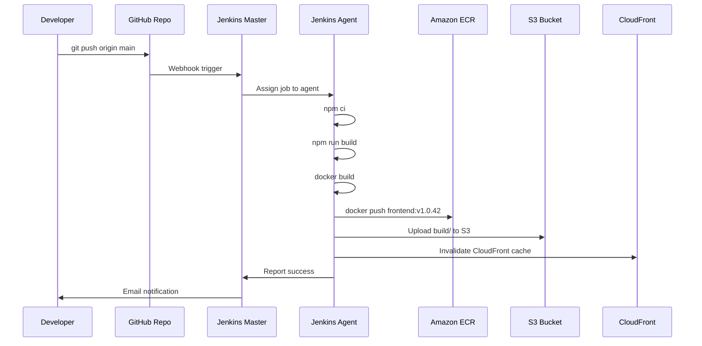
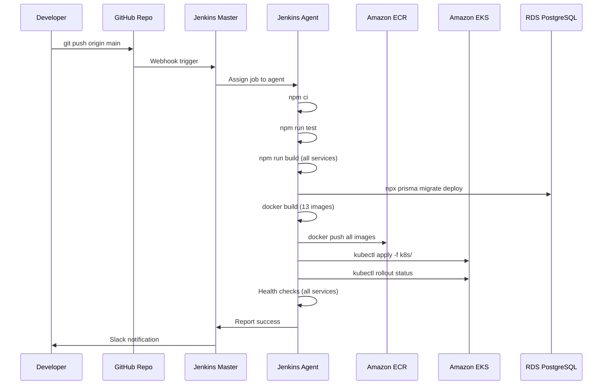
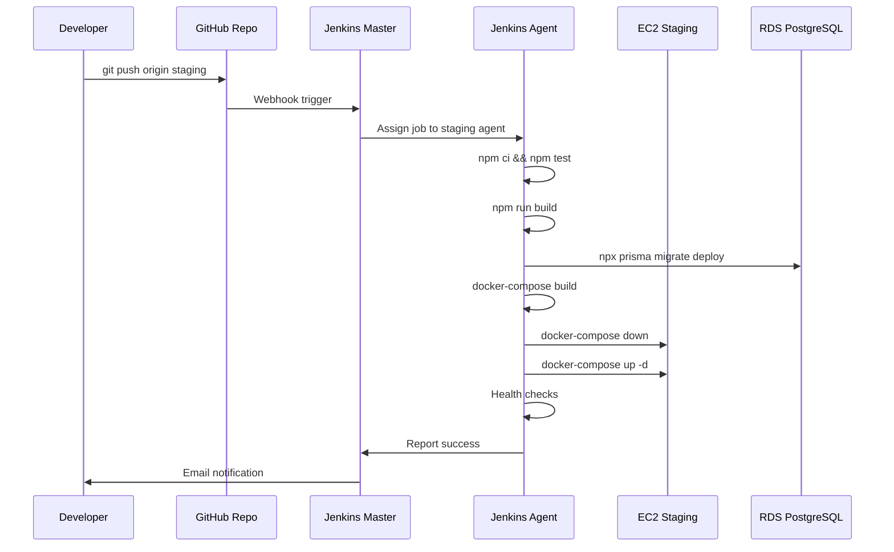

# Jenkins CI/CD Architecture with Shared Library

## Overview

This document presents the complete Jenkins CI/CD architecture for the Learning Hub platform, including the shared library structure, deployment pipelines, and integration with AWS infrastructure (EKS, ECR, RDS).

---

## Jenkins Architecture Diagram

```mermaid
graph TB
    subgraph Developer ["Developer Workflow"]
        Dev["👨‍💻 Developers"]
        Git["Git Repository<br/>(GitHub/GitLab)"]
    end

    subgraph JenkinsServer ["Jenkins Server"]
        JenkinsMaster["Jenkins Master<br/>(Controller)"]
        
        subgraph SharedLibrary ["Jenkins Shared Library<br/>microservices-deployment"]
            
            subgraph VarsDir ["vars/ Directory<br/>(Pipeline Functions)"]
                DeployFrontend["deployFrontend.groovy<br/>Frontend Pipeline"]
                DeployBackend["deployBackend.groovy<br/>Backend Pipeline"]
                DeployMicro["deployMicroservices.groovy<br/>Full Platform Pipeline"]
                DeployService["deployService.groovy<br/>Single Service Pipeline"]
            end
            
            subgraph SrcDir ["src/org/example/deployment/<br/>(Helper Classes)"]
                DeployHelper["DeploymentHelper.groovy<br/>Utility Functions"]
            end
        end
        
        subgraph Pipelines ["Jenkins Pipelines"]
            
            subgraph FrontendPipeline ["Frontend Pipeline"]
                FE1["Stage: Checkout Code"]
                FE2["Stage: Install Dependencies<br/>(npm ci)"]
                FE3["Stage: Build Frontend<br/>(npm run build)"]
                FE4["Stage: Build Docker Image"]
                FE5["Stage: Push to ECR<br/>(Production Only)"]
                FE6["Stage: Deploy to Environment"]
                
                FE1 --> FE2 --> FE3 --> FE4 --> FE5 --> FE6
            end
            
            subgraph BackendPipeline ["Backend Pipeline"]
                BE1["Stage: Checkout Code"]
                BE2["Stage: Install Dependencies<br/>(npm ci)"]
                BE3["Stage: Run Tests<br/>(Unit + Integration)"]
                BE4["Stage: Build Services<br/>(NestJS Build)"]
                BE5["Stage: Run Prisma Migrations"]
                BE6["Stage: Build Docker Images<br/>(13 microservices)"]
                BE7["Stage: Push to ECR<br/>(Production Only)"]
                BE8["Stage: Deploy to EKS/EC2"]
                BE9["Stage: Health Checks"]
                
                BE1 --> BE2 --> BE3 --> BE4 --> BE5 --> BE6 --> BE7 --> BE8 --> BE9
            end
        end
        
        subgraph JenkinsAgents ["Jenkins Agents (Workers)"]
            Agent1["Agent 1<br/>Node.js + Docker"]
            Agent2["Agent 2<br/>Node.js + Docker"]
            Agent3["Agent 3<br/>Node.js + Docker + kubectl"]
        end
    end

    subgraph BuildTools ["Build Tools & Dependencies"]
        NodeJS["Node.js 18<br/>(npm/yarn)"]
        Docker["Docker Engine<br/>(Image Building)"]
        Kubectl["kubectl CLI<br/>(K8s Deployment)"]
        AWSCLI["AWS CLI<br/>(ECR Push)"]
    end

    subgraph AWSInfra ["AWS Infrastructure"]
        
        subgraph ECR ["Amazon ECR<br/>(Container Registry)"]
            ECRRepo1["learning-hub/frontend"]
            ECRRepo2["learning-hub/api-gateway"]
            ECRRepo3["learning-hub/user-service"]
            ECRRepo4["learning-hub/auth-service"]
            ECRRepo5["...11 more services"]
        end
        
        subgraph EKS ["Amazon EKS<br/>(Production)"]
            EKSCluster["EKS Cluster<br/>learning-hub-prod"]
            
            subgraph Namespace ["Namespace: backend-prod"]
                K8sDeploy["Kubernetes Deployments<br/>(13 microservices)"]
                K8sService["Kubernetes Services<br/>(ClusterIP/LoadBalancer)"]
            end
        end
        
        subgraph EC2Staging ["EC2 (Staging)"]
            EC2Instance["EC2 Instance<br/>t3.large"]
            DockerCompose["Docker Compose<br/>(All Services)"]
        end
        
        subgraph DataLayer ["Data Layer"]
            RDS["Amazon RDS<br/>PostgreSQL"]
            ElastiCache["ElastiCache<br/>Redis"]
            S3["S3 Buckets<br/>(Static Assets)"]
        end
        
        subgraph Monitoring ["Monitoring"]
            CloudWatch["CloudWatch<br/>(Logs + Metrics)"]
            XRay["AWS X-Ray<br/>(Tracing)"]
        end
    end

    subgraph NotificationChannels ["Notification Channels"]
        Email["📧 Email<br/>(Build Status)"]
        Slack["💬 Slack<br/>(Deployment Alerts)"]
    end

    %% Developer Flow
    Dev -->|Push Code| Git
    Git -->|Webhook| JenkinsMaster

    %% Jenkins Master to Shared Library
    JenkinsMaster -.->|Load| SharedLibrary
    
    %% Shared Library Functions
    DeployFrontend -.->|Uses| DeployHelper
    DeployBackend -.->|Uses| DeployHelper
    DeployMicro -.->|Uses| DeployHelper
    DeployService -.->|Uses| DeployHelper

    %% Pipeline Selection
    JenkinsMaster -->|Frontend Job| FrontendPipeline
    JenkinsMaster -->|Backend Job| BackendPipeline

    %% Pipeline Execution
    FrontendPipeline -->|Runs on| Agent1
    BackendPipeline -->|Runs on| Agent2
    BackendPipeline -->|Runs on| Agent3

    %% Agents Use Tools
    Agent1 -.-> NodeJS
    Agent1 -.-> Docker
    Agent2 -.-> NodeJS
    Agent2 -.-> Docker
    Agent3 -.-> NodeJS
    Agent3 -.-> Docker
    Agent3 -.-> Kubectl
    Agent3 -.-> AWSCLI

    %% Docker Images to ECR
    Agent1 -->|Push Frontend<br/>Docker Image| ECRRepo1
    Agent2 -->|Push Backend<br/>Docker Images| ECRRepo2
    Agent2 -->|Push Images| ECRRepo3
    Agent2 -->|Push Images| ECRRepo4
    Agent2 -->|Push Images| ECRRepo5

    %% Deployment Paths
    Agent3 -->|kubectl apply<br/>(Production)| EKSCluster
    EKSCluster --> K8sDeploy
    K8sDeploy --> K8sService
    
    Agent2 -->|docker-compose up<br/>(Staging)| EC2Instance
    EC2Instance --> DockerCompose

    %% Services Connect to Data Layer
    K8sService -.-> RDS
    K8sService -.-> ElastiCache
    K8sService -.-> S3
    DockerCompose -.-> RDS
    DockerCompose -.-> ElastiCache

    %% Monitoring
    EKSCluster -.-> CloudWatch
    EKSCluster -.-> XRay
    EC2Instance -.-> CloudWatch

    %% Notifications
    JenkinsMaster -->|Success/Failure| Email
    JenkinsMaster -->|Deployment Status| Slack

    classDef jenkins fill:#D24939,stroke:#C02C1A,stroke-width:2px,color:#fff
    classDef library fill:#2E86AB,stroke:#1A5276,stroke-width:2px,color:#fff
    classDef pipeline fill:#10B981,stroke:#059669,stroke-width:2px,color:#fff
    classDef aws fill:#FF9900,stroke:#232F3E,stroke-width:2px,color:#fff
    classDef tools fill:#8B5CF6,stroke:#6D28D9,stroke-width:2px,color:#fff
    classDef notification fill:#F59E0B,stroke:#D97706,stroke-width:2px,color:#fff

    class JenkinsMaster,Agent1,Agent2,Agent3 jenkins
    class DeployFrontend,DeployBackend,DeployMicro,DeployService,DeployHelper library
    class FE1,FE2,FE3,FE4,FE5,FE6,BE1,BE2,BE3,BE4,BE5,BE6,BE7,BE8,BE9 pipeline
    class ECR,ECRRepo1,ECRRepo2,ECRRepo3,ECRRepo4,ECRRepo5,EKS,EKSCluster,K8sDeploy,K8sService,EC2Instance,RDS,ElastiCache,S3,CloudWatch,XRay aws
    class NodeJS,Docker,Kubectl,AWSCLI,DockerCompose tools
    class Email,Slack notification
```

---

## Shared Library Structure

### Directory Layout

```
jenkins-shared-library/
├── vars/
│   ├── deployFrontend.groovy          # Frontend deployment pipeline
│   ├── deployBackend.groovy           # Backend services deployment
│   ├── deployMicroservices.groovy     # Full platform deployment
│   └── deployService.groovy           # Single service deployment
├── src/
│   └── org/
│       └── example/
│           └── deployment/
│               └── DeploymentHelper.groovy  # Helper utility class
└── README.md
```

---

## Pipeline Functions

### 1. deployFrontend.groovy

**Purpose**: Deploy React frontend application

**Pipeline Stages**:
1. **Checkout**: Clone repository
2. **Install Dependencies**: `npm ci`
3. **Build**: `npm run build` → creates dist/ folder
4. **Docker Build**: Build frontend Docker image
5. **Push to ECR**: Push image to AWS ECR (production only)
6. **Deploy**: 
   - Staging: Local Docker container
   - Production: Update EKS/CloudFront

**Usage**:
```groovy
@Library('microservices-deployment') _

deployFrontend(
    nodeVersion: '18',
    buildDir: 'dist',
    registry: '123456789.dkr.ecr.us-east-1.amazonaws.com',
    imageName: 'learning-hub/frontend',
    tag: "v1.0.${BUILD_NUMBER}",
    environment: 'production'
)
```

---

### 2. deployBackend.groovy

**Purpose**: Deploy NestJS backend microservices

**Pipeline Stages**:
1. **Checkout**: Clone repository
2. **Install Dependencies**: `npm ci`
3. **Run Tests**: Unit + integration tests
4. **Build Services**: Build specific or all services
5. **Prisma Migrations**: Run database migrations
6. **Docker Build**: Build Docker images for each service
7. **Push to ECR**: Push images to AWS ECR (production)
8. **Deploy**: 
   - Staging: Docker Compose on EC2
   - Production: Kubernetes on EKS
9. **Health Checks**: Verify services are running

**Usage**:
```groovy
@Library('microservices-deployment') _

deployBackend(
    nodeVersion: '18',
    services: ['api-gateway', 'user-service', 'course-service'], // or [] for all
    registry: '123456789.dkr.ecr.us-east-1.amazonaws.com',
    tag: "v1.0.${BUILD_NUMBER}",
    environment: 'production'
)
```

---

### 3. deployMicroservices.groovy

**Purpose**: Deploy complete platform (frontend + backend)

**Pipeline Stages**:
- Combines frontend and backend pipelines
- Deploys all services in correct order
- Runs comprehensive health checks

**Usage**:
```groovy
@Library('microservices-deployment') _

deployMicroservices(
    nodeVersion: '18',
    frontendBuildDir: 'dist',
    backendServices: [], // Empty = all services
    registry: '123456789.dkr.ecr.us-east-1.amazonaws.com',
    tag: "v1.0.${BUILD_NUMBER}",
    environment: 'production'
)
```

---

### 4. deployService.groovy

**Purpose**: Deploy a single microservice independently

**Usage**:
```groovy
@Library('microservices-deployment') _

deployService(
    serviceName: 'payment-service',
    nodeVersion: '18',
    registry: '123456789.dkr.ecr.us-east-1.amazonaws.com',
    tag: "v1.0.${BUILD_NUMBER}",
    environment: 'production'
)
```

---

## DeploymentHelper Utility Class

### Available Functions

#### 1. getAllServices()
Returns list of all 13 microservices

```groovy
def helper = new DeploymentHelper(this)
def services = helper.getAllServices()
// Returns: ['api-gateway', 'user-service', 'auth-service', ...]
```

#### 2. isValidService(serviceName)
Validates if service exists

```groovy
if (helper.isValidService('payment-service')) {
    echo "Valid service"
}
```

#### 3. getImageName(serviceName, registry, tag)
Constructs Docker image name

```groovy
def imageName = helper.getImageName(
    'user-service', 
    '123456789.dkr.ecr.us-east-1.amazonaws.com',
    'v1.0.42'
)
// Returns: 123456789.dkr.ecr.us-east-1.amazonaws.com/user-service:v1.0.42
```

#### 4. deployWithDockerCompose(serviceName)
Deploy using Docker Compose (staging)

```groovy
helper.deployWithDockerCompose('user-service')
// or deploy all:
helper.deployWithDockerCompose()
```

#### 5. deployWithKubernetes(serviceName, environment)
Deploy to EKS cluster (production)

```groovy
helper.deployWithKubernetes('user-service', 'production')
// Applies: backend/k8s/user-service.yaml to namespace backend-prod
```

#### 6. buildDockerImage(serviceName, tag)
Build Docker image for service

```groovy
helper.buildDockerImage('course-service', 'v1.0.42')
```

#### 7. pushDockerImage(serviceName, registry, tag, credentials)
Push image to ECR with authentication

```groovy
helper.pushDockerImage(
    'enrollment-service',
    '123456789.dkr.ecr.us-east-1.amazonaws.com',
    'v1.0.42',
    'aws-ecr-credentials'
)
```

#### 8. runPrismaMigrations()
Execute Prisma database migrations

```groovy
helper.runPrismaMigrations()
// Runs: npx prisma generate && npx prisma migrate deploy
```

#### 9. healthCheck(serviceName, port, retries)
Verify service health

```groovy
helper.healthCheck('api-gateway', '3000', 5)
// Retries 5 times with 10-second intervals
```

---

## Deployment Workflows

### Workflow 1: Frontend Deployment (Production)



### Workflow 2: Backend Deployment (Production)



### Workflow 3: Staging Deployment (Docker Compose)



---

## Environment-Specific Configurations

### Staging Environment
- **Deployment Target**: EC2 instance with Docker Compose
- **Image Registry**: Local Docker daemon (no push to ECR)
- **Database**: Shared RDS instance (staging schema)
- **Services**: All 13 microservices in single docker-compose.yml
- **Health Checks**: HTTP GET to /health endpoint
- **Rollback**: `docker-compose down && docker-compose up -d` (previous images)

### Production Environment
- **Deployment Target**: Amazon EKS cluster
- **Image Registry**: Amazon ECR (pushed with versioning)
- **Database**: RDS Multi-AZ (production schema)
- **Services**: Kubernetes Deployments (3 replicas each)
- **Health Checks**: Kubernetes liveness/readiness probes
- **Rollback**: `kubectl rollout undo deployment/<service>`

---

## Jenkins Job Configuration

### Job 1: Frontend Pipeline

```groovy
pipeline {
    agent any
    
    parameters {
        choice(name: 'ENVIRONMENT', choices: ['staging', 'production'], description: 'Deployment environment')
        string(name: 'TAG', defaultValue: 'latest', description: 'Docker image tag')
    }
    
    environment {
        AWS_REGION = 'us-east-1'
        ECR_REGISTRY = '123456789.dkr.ecr.us-east-1.amazonaws.com'
    }
    
    stages {
        stage('Deploy') {
            steps {
                script {
                    @Library('microservices-deployment') _
                    deployFrontend(
                        nodeVersion: '18',
                        buildDir: 'dist',
                        registry: env.ECR_REGISTRY,
                        imageName: 'learning-hub/frontend',
                        tag: params.TAG,
                        environment: params.ENVIRONMENT
                    )
                }
            }
        }
    }
}
```

### Job 2: Backend Pipeline

```groovy
pipeline {
    agent any
    
    parameters {
        choice(name: 'ENVIRONMENT', choices: ['staging', 'production'], description: 'Deployment environment')
        string(name: 'TAG', defaultValue: 'latest', description: 'Docker image tag')
        text(name: 'SERVICES', defaultValue: '', description: 'Comma-separated services (empty = all)')
    }
    
    environment {
        AWS_REGION = 'us-east-1'
        ECR_REGISTRY = '123456789.dkr.ecr.us-east-1.amazonaws.com'
    }
    
    stages {
        stage('Deploy') {
            steps {
                script {
                    def servicesList = params.SERVICES ? params.SERVICES.split(',') : []
                    
                    @Library('microservices-deployment') _
                    deployBackend(
                        nodeVersion: '18',
                        services: servicesList,
                        registry: env.ECR_REGISTRY,
                        tag: params.TAG,
                        environment: params.ENVIRONMENT
                    )
                }
            }
        }
    }
}
```

---

## Microservices List (13 Total)

| Service | Port | Kubernetes ClusterIP | Purpose |
|---------|------|----------------------|---------|
| **api-gateway** | 3000 | `api-gateway.backend-prod.svc.cluster.local` | API Gateway |
| **user-service** | 3001 | `user-service.backend-prod.svc.cluster.local` | User management |
| **auth-service** | 3002 | `auth-service.backend-prod.svc.cluster.local` | Authentication |
| **course-service** | 3003 | `course-service.backend-prod.svc.cluster.local` | Course CRUD |
| **enrollment-service** | 3004 | `enrollment-service.backend-prod.svc.cluster.local` | Enrollments |
| **payment-service** | 3005 | `payment-service.backend-prod.svc.cluster.local` | Payments |
| **media-service** | 3006 | `media-service.backend-prod.svc.cluster.local` | File uploads |
| **notification-service** | 3007 | `notification-service.backend-prod.svc.cluster.local` | Notifications |
| **content-service** | 3008 | `content-service.backend-prod.svc.cluster.local` | Content |
| **assessment-service** | 3009 | `assessment-service.backend-prod.svc.cluster.local` | Assessments |
| **review-service** | 3010 | `review-service.backend-prod.svc.cluster.local` | Reviews |
| **certificate-service** | 3011 | `certificate-service.backend-prod.svc.cluster.local` | Certificates |
| **gamification-service** | 3012 | `gamification-service.backend-prod.svc.cluster.local` | Gamification |

---

## CI/CD Best Practices

### ✅ Version Control
- Semantic versioning: `v{major}.{minor}.{BUILD_NUMBER}`
- Git tags for release tracking
- Branch protection for main/production

### ✅ Testing Strategy
- Unit tests run before build
- Integration tests after build
- Health checks after deployment
- Smoke tests in production

### ✅ Security
- Credentials stored in Jenkins Credentials store
- AWS credentials via IAM roles
- Docker images scanned for vulnerabilities
- Secrets never logged in console output

### ✅ Rollback Strategy
- Keep last 3 Docker image versions
- Kubernetes rollout undo capability
- Database migration rollback scripts
- Automated rollback on health check failure

### ✅ Monitoring
- CloudWatch logs aggregation
- Deployment success/failure metrics
- Build duration tracking
- Email/Slack notifications

---

## Cost Optimization

### Jenkins Infrastructure
- **Master**: t3.medium EC2 instance (~$30/month)
- **Agents**: 3 × t3.large (~$150/month)
- **EBS Storage**: 100 GB (~$10/month)
- **Total**: ~$190/month

### Optimization Strategies
1. Use spot instances for Jenkins agents (50-70% savings)
2. Auto-scale agents based on job queue
3. Clean up old build artifacts weekly
4. Use ECR lifecycle policies to remove old images

---

## Conclusion

The Jenkins CI/CD architecture with shared library provides:

✅ **Reusability**: Shared pipeline functions across all projects
✅ **Consistency**: Standardized deployment process
✅ **Flexibility**: Environment-specific configurations
✅ **Scalability**: Agent-based distributed builds
✅ **Reliability**: Automated testing and health checks
✅ **Visibility**: Comprehensive logging and notifications
✅ **Maintainability**: Centralized helper utilities

This architecture supports continuous deployment of all 13 microservices with automated testing, database migrations, and multi-environment management.
