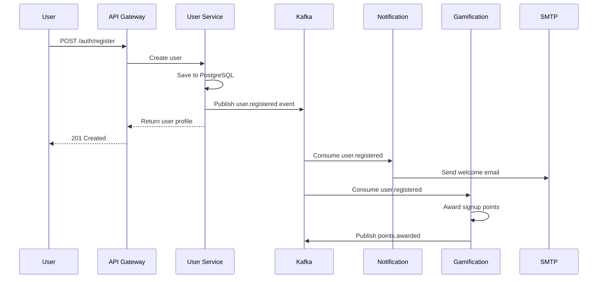
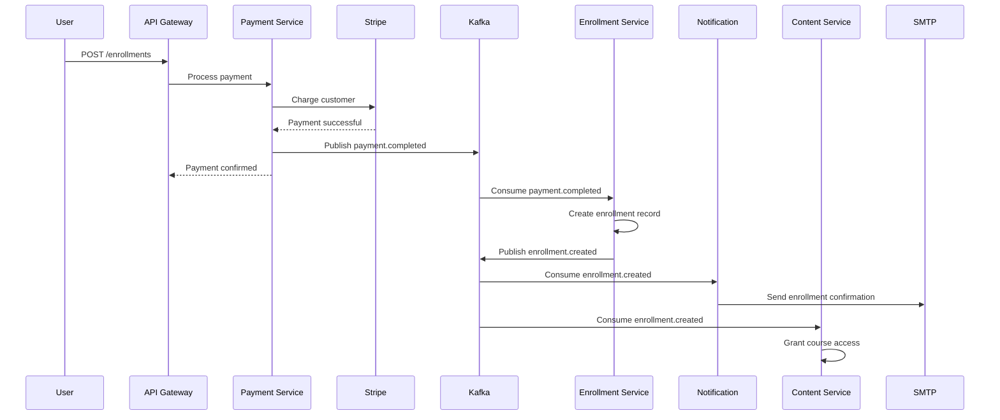
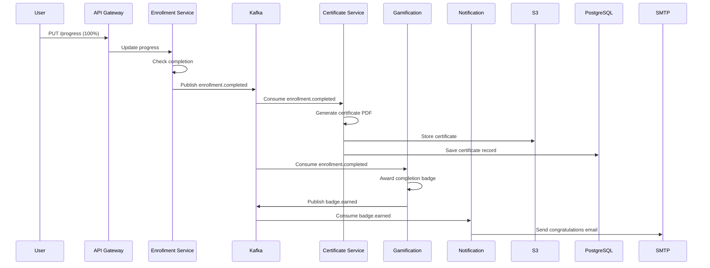
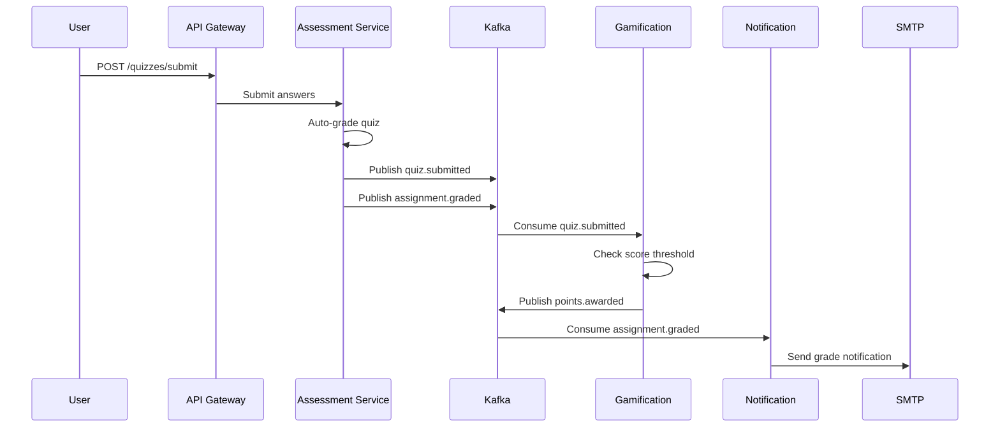

# Learning Hub - Kafka Integration Architecture

## Overview

This document presents a comprehensive Apache Kafka integration architecture for the Learning Hub platform, showing how Kafka enables event-driven communication between the 13 microservices for real-time, scalable, and decoupled messaging.

---

## Kafka Integration Architecture Diagram

```mermaid
graph TB
    subgraph Internet ["🌐 Internet / Users"]
        Users["Users<br/>(Web/Mobile)"]
    end

    subgraph CDN ["CloudFront + ALB"]
        CF["CloudFront CDN"]
        ALB["Application Load Balancer"]
    end

    subgraph VPC ["VPC: Learning Hub (10.0.0.0/16)"]
        
        subgraph EKS ["Amazon EKS Cluster - Microservices"]
            
            APIGW["API Gateway<br/>:3000"]
            
            subgraph Producers ["Event Producers"]
                UserSvc["User Service<br/>:3001"]
                AuthSvc["Auth Service<br/>:3002"]
                CourseSvc["Course Service<br/>:3003"]
                EnrollSvc["Enrollment Service<br/>:3004"]
                PaymentSvc["Payment Service<br/>:3005"]
                MediaSvc["Media Service<br/>:3006"]
                AssessSvc["Assessment Service<br/>:3009"]
            end
            
            subgraph Consumers ["Event Consumers"]
                NotifSvc["Notification Service<br/>:3007"]
                ContentSvc["Content Service<br/>:3008"]
                ReviewSvc["Review Service<br/>:3010"]
                CertSvc["Certificate Service<br/>:3011"]
                GamifySvc["Gamification Service<br/>:3012"]
            end
        end

        subgraph KafkaCluster ["Amazon MSK (Managed Kafka) - Private Subnet"]
            
            subgraph Brokers ["Kafka Brokers (3 nodes)"]
                Broker1["Broker 1<br/>AZ-1"]
                Broker2["Broker 2<br/>AZ-2"]
                Broker3["Broker 3<br/>AZ-3"]
            end
            
            subgraph Topics ["Kafka Topics"]
                
                subgraph UserTopics ["User Events"]
                    T1["user.registered<br/>(3 partitions)"]
                    T2["user.updated<br/>(3 partitions)"]
                    T3["user.deleted<br/>(3 partitions)"]
                end
                
                subgraph CourseTopics ["Course Events"]
                    T4["course.created<br/>(3 partitions)"]
                    T5["course.updated<br/>(3 partitions)"]
                    T6["course.published<br/>(3 partitions)"]
                end
                
                subgraph EnrollmentTopics ["Enrollment Events"]
                    T7["enrollment.created<br/>(5 partitions)"]
                    T8["enrollment.completed<br/>(3 partitions)"]
                    T9["progress.updated<br/>(5 partitions)"]
                end
                
                subgraph PaymentTopics ["Payment Events"]
                    T10["payment.initiated<br/>(3 partitions)"]
                    T11["payment.completed<br/>(5 partitions)"]
                    T12["payment.failed<br/>(3 partitions)"]
                    T13["subscription.created<br/>(3 partitions)"]
                end
                
                subgraph MediaTopics ["Media Events"]
                    T14["media.uploaded<br/>(3 partitions)"]
                    T15["media.processed<br/>(3 partitions)"]
                end
                
                subgraph AssessmentTopics ["Assessment Events"]
                    T16["quiz.submitted<br/>(3 partitions)"]
                    T17["assignment.graded<br/>(3 partitions)"]
                end
                
                subgraph NotificationTopics ["Notification Events"]
                    T18["notification.email<br/>(5 partitions)"]
                    T19["notification.push<br/>(3 partitions)"]
                end
                
                subgraph GamificationTopics ["Gamification Events"]
                    T20["badge.earned<br/>(3 partitions)"]
                    T21["points.awarded<br/>(3 partitions)"]
                end
            end
            
            ZK["Zookeeper Ensemble<br/>(3 nodes)"]
        end

        subgraph Monitoring ["Kafka Monitoring"]
            KafkaUI["Kafka UI<br/>(Management Console)"]
            SchemaReg["Schema Registry<br/>(Avro Schemas)"]
        end

        subgraph Database ["Data Layer"]
            RDS["Amazon RDS<br/>PostgreSQL"]
            ElastiCache["ElastiCache<br/>Redis"]
        end
    end

    subgraph External ["External Services"]
        SMTP["SMTP Server<br/>(Email Delivery)"]
        Stripe["Stripe<br/>(Payment Gateway)"]
    end

    subgraph AWS_Services ["AWS Monitoring"]
        CW["CloudWatch<br/>(Metrics & Logs)"]
        XRay["AWS X-Ray<br/>(Tracing)"]
    end

    %% User Flow
    Users -->|HTTPS| CF
    CF --> ALB
    ALB --> APIGW

    %% API Gateway to Services
    APIGW --> UserSvc
    APIGW --> AuthSvc
    APIGW --> CourseSvc
    APIGW --> EnrollSvc
    APIGW --> PaymentSvc
    APIGW --> MediaSvc
    APIGW --> AssessSvc

    %% Producer to Kafka Topics
    UserSvc ==>|Publish| T1
    UserSvc ==>|Publish| T2
    UserSvc ==>|Publish| T3
    
    CourseSvc ==>|Publish| T4
    CourseSvc ==>|Publish| T5
    CourseSvc ==>|Publish| T6
    
    EnrollSvc ==>|Publish| T7
    EnrollSvc ==>|Publish| T8
    EnrollSvc ==>|Publish| T9
    
    PaymentSvc ==>|Publish| T10
    PaymentSvc ==>|Publish| T11
    PaymentSvc ==>|Publish| T12
    PaymentSvc ==>|Publish| T13
    
    MediaSvc ==>|Publish| T14
    MediaSvc ==>|Publish| T15
    
    AssessSvc ==>|Publish| T16
    AssessSvc ==>|Publish| T17

    %% Kafka Topics to Consumers
    T1 ==>|Subscribe| NotifSvc
    T1 ==>|Subscribe| GamifySvc
    
    T7 ==>|Subscribe| NotifSvc
    T7 ==>|Subscribe| ContentSvc
    T7 ==>|Subscribe| GamifySvc
    
    T8 ==>|Subscribe| NotifSvc
    T8 ==>|Subscribe| CertSvc
    T8 ==>|Subscribe| GamifySvc
    
    T9 ==>|Subscribe| GamifySvc
    
    T11 ==>|Subscribe| EnrollSvc
    T11 ==>|Subscribe| NotifSvc
    
    T12 ==>|Subscribe| NotifSvc
    
    T13 ==>|Subscribe| NotifSvc
    
    T15 ==>|Subscribe| ContentSvc
    
    T16 ==>|Subscribe| GamifySvc
    T16 ==>|Subscribe| NotifSvc
    
    T17 ==>|Subscribe| NotifSvc
    T17 ==>|Subscribe| GamifySvc
    
    T20 ==>|Subscribe| NotifSvc
    T21 ==>|Subscribe| NotifSvc

    %% Consumer Actions
    NotifSvc --> SMTP
    PaymentSvc --> Stripe
    
    %% Services to Database
    UserSvc -.-> RDS
    CourseSvc -.-> RDS
    EnrollSvc -.-> RDS
    PaymentSvc -.-> RDS
    CertSvc -.-> RDS
    GamifySvc -.-> RDS
    
    %% Cache
    UserSvc -.-> ElastiCache
    CourseSvc -.-> ElastiCache
    
    %% Monitoring
    KafkaCluster -.-> CW
    Producers -.-> XRay
    Consumers -.-> XRay
    
    %% Kafka Management
    ZK -.->|Manages| Brokers
    SchemaReg -.-> Brokers
    KafkaUI -.->|Monitor| Brokers

    classDef producer fill:#3B82F6,stroke:#1E40AF,stroke-width:2px,color:#fff
    classDef consumer fill:#10B981,stroke:#059669,stroke-width:2px,color:#fff
    classDef kafka fill:#FF6B6B,stroke:#C92A2A,stroke-width:3px,color:#fff
    classDef topic fill:#F59E0B,stroke:#D97706,stroke-width:2px,color:#000
    classDef aws fill:#FF9900,stroke:#232F3E,stroke-width:2px,color:#fff
    classDef monitoring fill:#8B5CF6,stroke:#6D28D9,stroke-width:2px,color:#fff

    class UserSvc,AuthSvc,CourseSvc,EnrollSvc,PaymentSvc,MediaSvc,AssessSvc producer
    class NotifSvc,ContentSvc,ReviewSvc,CertSvc,GamifySvc consumer
    class Broker1,Broker2,Broker3,ZK kafka
    class T1,T2,T3,T4,T5,T6,T7,T8,T9,T10,T11,T12,T13,T14,T15,T16,T17,T18,T19,T20,T21 topic
    class RDS,ElastiCache,CF,ALB aws
    class KafkaUI,SchemaReg,CW,XRay monitoring
```



---

## Kafka Topics Overview

### Topic Naming Convention
Format: `<domain>.<event>` (e.g., `user.registered`, `payment.completed`)

### Topic Configuration

| Topic Name | Partitions | Replication | Retention | Description |
|------------|------------|-------------|-----------|-------------|
| **user.registered** | 3 | 3 | 7 days | New user registration events |
| **user.updated** | 3 | 3 | 7 days | User profile update events |
| **user.deleted** | 3 | 3 | 30 days | User account deletion events |
| **course.created** | 3 | 3 | 30 days | New course creation events |
| **course.updated** | 3 | 3 | 7 days | Course content update events |
| **course.published** | 3 | 3 | 30 days | Course publication events |
| **enrollment.created** | 5 | 3 | 30 days | Student enrollment events |
| **enrollment.completed** | 3 | 3 | 90 days | Course completion events |
| **progress.updated** | 5 | 3 | 7 days | Learning progress tracking |
| **payment.initiated** | 3 | 3 | 90 days | Payment initiation events |
| **payment.completed** | 5 | 3 | 365 days | Successful payment events |
| **payment.failed** | 3 | 3 | 90 days | Failed payment events |
| **subscription.created** | 3 | 3 | 365 days | Subscription plan events |
| **media.uploaded** | 3 | 3 | 30 days | File upload completion |
| **media.processed** | 3 | 3 | 30 days | Media transcoding/processing |
| **quiz.submitted** | 3 | 3 | 90 days | Quiz submission events |
| **assignment.graded** | 3 | 3 | 90 days | Assignment grading events |
| **notification.email** | 5 | 3 | 7 days | Email notification queue |
| **notification.push** | 3 | 3 | 7 days | Push notification queue |
| **badge.earned** | 3 | 3 | 365 days | Badge achievement events |
| **points.awarded** | 3 | 3 | 90 days | Points/rewards events |

---

## Event Flow Patterns

### Pattern 1: User Registration Flow



### Pattern 2: Course Enrollment with Payment



### Pattern 3: Course Completion & Certification



### Pattern 4: Quiz Submission & Grading



---

## Producer-Consumer Mapping

### User Service (Producer)
**Publishes to:**
- `user.registered` → consumed by: Notification, Gamification
- `user.updated` → consumed by: Notification (profile change alerts)
- `user.deleted` → consumed by: Notification, all services (cleanup)

### Course Service (Producer)
**Publishes to:**
- `course.created` → consumed by: Notification (instructor), Search indexer (future)
- `course.updated` → consumed by: Content Service (cache invalidation)
- `course.published` → consumed by: Notification (students), Recommendation engine (future)

### Enrollment Service (Producer)
**Publishes to:**
- `enrollment.created` → consumed by: Notification, Content Service, Gamification
- `enrollment.completed` → consumed by: Certificate Service, Notification, Gamification
- `progress.updated` → consumed by: Gamification (milestone tracking)

### Payment Service (Producer)
**Publishes to:**
- `payment.initiated` → consumed by: Analytics (future)
- `payment.completed` → consumed by: Enrollment Service, Notification
- `payment.failed` → consumed by: Notification (retry reminders)
- `subscription.created` → consumed by: Notification, User Service (update plan)

### Media Service (Producer)
**Publishes to:**
- `media.uploaded` → consumed by: Content Service (metadata), Transcoding service (future)
- `media.processed` → consumed by: Content Service (update status)

### Assessment Service (Producer)
**Publishes to:**
- `quiz.submitted` → consumed by: Gamification, Notification
- `assignment.graded` → consumed by: Notification, Gamification

### Gamification Service (Producer)
**Publishes to:**
- `badge.earned` → consumed by: Notification (achievement alerts)
- `points.awarded` → consumed by: Notification (milestone alerts)

---

## Notification Service (Consumer)

**Subscribes to:**
- `user.registered` → Welcome email
- `enrollment.created` → Enrollment confirmation
- `enrollment.completed` → Congratulations email
- `payment.completed` → Payment receipt
- `payment.failed` → Payment failed alert
- `subscription.created` → Subscription confirmation
- `quiz.submitted` → Quiz submitted confirmation
- `assignment.graded` → Grade notification
- `badge.earned` → Achievement notification
- `points.awarded` → Milestone notification

---

## Message Schema Examples

### Event: user.registered

```json
{
  "eventId": "evt_1234567890",
  "eventType": "user.registered",
  "timestamp": "2024-01-16T18:00:00Z",
  "version": "1.0",
  "data": {
    "userId": "usr_abc123",
    "email": "student@example.com",
    "firstName": "John",
    "lastName": "Doe",
    "role": "STUDENT",
    "registeredAt": "2024-01-16T18:00:00Z"
  },
  "metadata": {
    "correlationId": "req_xyz789",
    "source": "user-service",
    "traceId": "trace_456"
  }
}
```

### Event: payment.completed

```json
{
  "eventId": "evt_9876543210",
  "eventType": "payment.completed",
  "timestamp": "2024-01-16T18:05:00Z",
  "version": "1.0",
  "data": {
    "paymentId": "pay_def456",
    "userId": "usr_abc123",
    "courseId": "crs_ghi789",
    "amount": 49.99,
    "currency": "USD",
    "stripePaymentId": "pi_stripe123",
    "completedAt": "2024-01-16T18:05:00Z"
  },
  "metadata": {
    "correlationId": "req_payment123",
    "source": "payment-service",
    "traceId": "trace_789"
  }
}
```

### Event: enrollment.completed

```json
{
  "eventId": "evt_completion123",
  "eventType": "enrollment.completed",
  "timestamp": "2024-01-20T14:30:00Z",
  "version": "1.0",
  "data": {
    "enrollmentId": "enr_xyz123",
    "userId": "usr_abc123",
    "courseId": "crs_ghi789",
    "completedAt": "2024-01-20T14:30:00Z",
    "finalScore": 92.5,
    "duration": "30 days"
  },
  "metadata": {
    "correlationId": "req_complete456",
    "source": "enrollment-service",
    "traceId": "trace_comp999"
  }
}
```

---

## AWS Deployment: Amazon MSK (Managed Streaming for Kafka)

### MSK Cluster Configuration

#### Cluster Specifications
- **Cluster Type**: Provisioned (3 brokers)
- **Instance Type**: kafka.m5.large (2 vCPU, 8 GB RAM)
- **Broker Distribution**: 3 brokers across 3 availability zones
- **Storage**: 100 GB EBS per broker (auto-scaling enabled)
- **Kafka Version**: 3.5.1

#### Network Configuration
- **VPC**: Same VPC as EKS cluster (10.0.0.0/16)
- **Subnets**: Private subnets (10.0.20.0/24, 10.0.21.0/24, 10.0.22.0/24)
- **Security Group**: Allow traffic from EKS security group on port 9092
- **Encryption**: TLS in-transit, AWS KMS at-rest

#### Zookeeper
- **Nodes**: 3 Zookeeper nodes (managed by MSK)
- **Distribution**: Across 3 availability zones

---

## Kafka Best Practices

### 1. Topic Design
- **Partitioning**: Based on expected throughput
  - High-volume topics: 5 partitions (`enrollment.created`, `payment.completed`)
  - Medium-volume: 3 partitions (most topics)
- **Replication Factor**: 3 for all topics (high availability)
- **Retention**: Based on compliance and business needs
  - Financial: 365 days
  - User events: 30-90 days
  - Operational: 7 days

### 2. Message Design
- **Schema Management**: Use Schema Registry with Avro schemas
- **Event Versioning**: Include version field for schema evolution
- **Idempotency**: Include `eventId` for duplicate detection
- **Tracing**: Include `correlationId` and `traceId` for distributed tracing

### 3. Producer Best Practices
- **Acknowledgments**: `acks=all` for critical events (payments, enrollments)
- **Retries**: Configure retry logic with exponential backoff
- **Batching**: Enable batching for improved throughput
- **Compression**: Use `snappy` or `lz4` compression

### 4. Consumer Best Practices
- **Consumer Groups**: Unique group ID per consuming service
- **Offset Management**: Auto-commit disabled, manual commit after processing
- **Error Handling**: Dead Letter Queue (DLQ) for failed messages
- **Idempotency**: Check `eventId` to prevent duplicate processing

### 5. Monitoring
- **Key Metrics**:
  - Broker CPU and memory utilization
  - Under-replicated partitions
  - Consumer lag per topic
  - Message throughput (messages/sec)
  - Error rates

---

## Kafka vs RabbitMQ Comparison

| Feature | Kafka (Proposed) | RabbitMQ (Current) |
|---------|------------------|---------------------|
| **Message Model** | Publish-Subscribe with log | Queue-based with routing |
| **Throughput** | Very High (millions/sec) | Medium (tens of thousands/sec) |
| **Message Retention** | Configurable log retention | Deleted after consumption |
| **Ordering** | Partition-level ordering | Queue-level ordering |
| **Replay** | ✅ Yes (offset-based) | ❌ No |
| **Scalability** | Horizontal (add brokers/partitions) | Limited (vertical scaling) |
| **Use Case** | Event streaming, logs, analytics | Task queues, RPC |
| **AWS Managed** | Amazon MSK | Amazon MQ |
| **Complexity** | Higher learning curve | Simpler to get started |

### Why Kafka for Learning Hub?

1. **Event Replay**: Ability to replay events for data recovery or new consumers
2. **Audit Trail**: All events stored for compliance and analytics
3. **Scalability**: Handle millions of student interactions
4. **Stream Processing**: Future analytics and real-time dashboards
5. **Decoupling**: True event-driven architecture
6. **Performance**: High throughput for concurrent users

---

## Migration Strategy (RabbitMQ → Kafka)

### Phase 1: Parallel Running (2 weeks)
- Deploy MSK cluster alongside RabbitMQ
- Configure dual-publishing for select topics
- Monitor performance and stability

### Phase 2: Gradual Migration (4 weeks)
- **Week 1**: Migrate notification events
- **Week 2**: Migrate enrollment and payment events
- **Week 3**: Migrate user and course events
- **Week 4**: Migrate remaining events

### Phase 3: Decommission RabbitMQ (1 week)
- Verify all traffic on Kafka
- Remove RabbitMQ dependencies
- Decommission RabbitMQ cluster

---

## Estimated Costs (AWS MSK)

### MSK Cluster
- **Brokers**: 3 × kafka.m5.large = $0.21/hour × 3 = $0.63/hour
- **Storage**: 3 × 100 GB × $0.10/GB-month = $30/month
- **Data Transfer**: ~$50/month
- **Total MSK**: ~$500-600/month

### Additional Tools
- **Schema Registry**: AWS Glue Schema Registry (free tier)
- **Kafka UI**: Self-hosted on EKS (minimal cost)
- **CloudWatch**: ~$20/month for logs and metrics

**Total Kafka Infrastructure**: ~$550-650/month

---

## Monitoring & Observability

### CloudWatch Metrics
- **Broker Metrics**: CPU, memory, disk utilization
- **Topic Metrics**: Bytes in/out, message count
- **Consumer Metrics**: Consumer lag, fetch rate
- **Producer Metrics**: Request rate, error rate

### Custom Dashboards
1. **Operational Dashboard**: Broker health, partition status
2. **Performance Dashboard**: Throughput, latency
3. **Business Dashboard**: Event volume by type
4. **Consumer Dashboard**: Lag by consumer group

### Alerts
- **Critical**: Broker down, under-replicated partitions
- **High**: High consumer lag (> 10,000 messages)
- **Medium**: Elevated error rates
- **Low**: Storage utilization warnings

---

## Security

### Network Security
- **Private Subnets**: MSK brokers in private subnets
- **Security Groups**: Restrict access to EKS pods only
- **No Public Access**: Brokers not accessible from internet

### Data Security
- **Encryption in Transit**: TLS 1.3 for all connections
- **Encryption at Rest**: AWS KMS encryption for EBS volumes
- **Authentication**: SASL/SCRAM or IAM authentication
- **Authorization**: Kafka ACLs for topic-level permissions

### Access Control
- **Producer Permissions**: Write access to specific topics
- **Consumer Permissions**: Read access to subscribed topics
- **Admin Access**: Limited to DevOps team via IAM roles

---

## Future Enhancements

1. **Kafka Streams**: Real-time stream processing
2. **KSQLDB**: SQL-based stream processing
3. **Kafka Connect**: Integration with external systems
4. **Schema Evolution**: Advanced schema versioning
5. **Multi-Region Replication**: Cross-region disaster recovery
6. **Event Sourcing**: Full event sourcing architecture
7. **CQRS Pattern**: Command Query Responsibility Segregation

---

## Conclusion

Integrating Apache Kafka into the Learning Hub architecture provides:

✅ **Scalability**: Handle millions of events per day
✅ **Reliability**: Message persistence and replication
✅ **Decoupling**: True event-driven microservices
✅ **Auditability**: Complete event history
✅ **Performance**: High throughput and low latency
✅ **Flexibility**: Event replay and stream processing

The architecture enables real-time, event-driven communication between all 13 microservices while maintaining system resilience and observability.
