# Learning Hub - System Design (Technology-Agnostic)

## Overview

This document presents the high-level system design for the Learning Hub platform - a scalable e-learning management system. This design focuses on architectural patterns, components, and scalability strategies independent of any specific cloud provider or deployment technology.

---

## High-Level System Design

```mermaid
graph TB
    subgraph Clients ["Client Applications"]
        WebApp["Web Application<br/>(SPA)"]
        MobileApp["Mobile App<br/>(Native/Hybrid)"]
        AdminPanel["Admin Panel"]
    end

    subgraph EdgeLayer ["Edge/CDN Layer"]
        CDN["CDN<br/>(Static Content)<br/>- HTML, CSS, JS<br/>- Images, Videos"]
        LoadBalancer["Load Balancer<br/>(Layer 7)<br/>- SSL Termination<br/>- Health Checks"]
    end

    subgraph APIGatewayLayer ["API Gateway"]
        Gateway["API Gateway<br/>- Authentication<br/>- Rate Limiting<br/>- Request Routing<br/>- API Versioning"]
    end

    subgraph ApplicationServices ["Application Services (Microservices)"]
        
        subgraph UserManagement ["User Management"]
            AuthService["Authentication Service<br/>- Login/Logout<br/>- JWT Token<br/>- Session Mgmt"]
            UserService["User Service<br/>- User CRUD<br/>- Profile<br/>- Roles/Permissions"]
        end

        subgraph ContentManagement ["Content Management"]
            CourseService["Course Service<br/>- Course CRUD<br/>- Curriculum<br/>- Categories"]
            LessonService["Lesson Service<br/>- Lessons<br/>- Resources<br/>- Content"]
            MediaService["Media Service<br/>- File Upload<br/>- Processing<br/>- Delivery"]
        end

        subgraph LearningServices ["Learning Services"]
            EnrollmentService["Enrollment Service<br/>- Enrollments<br/>- Progress<br/>- Completion"]
            AssessmentService["Assessment Service<br/>- Quizzes<br/>- Assignments<br/>- Grading"]
            CertificateService["Certificate Service<br/>- Generation<br/>- Verification"]
        end

        subgraph SupportServices ["Support Services"]
            PaymentService["Payment Service<br/>- Payments<br/>- Subscriptions<br/>- Billing"]
            NotificationService["Notification Service<br/>- Email<br/>- Push<br/>- In-App"]
            SearchService["Search Service<br/>- Full-Text Search<br/>- Autocomplete<br/>- Filters"]
        end
    end

    subgraph MessageQueue ["Message Queue / Event Bus"]
        MQ["Message Broker<br/>- Async Communication<br/>- Event Streaming<br/>- Pub/Sub Pattern"]
    end

    subgraph DataLayer ["Data Layer"]
        
        subgraph PrimaryStorage ["Primary Storage"]
            DB["Relational Database<br/>(ACID)<br/>- Users<br/>- Courses<br/>- Enrollments<br/>- Payments"]
        end

        subgraph ReadOptimization ["Read Optimization"]
            ReadReplica["Read Replicas<br/>(Read-Only)<br/>- Analytics<br/>- Reports<br/>- Search"]
        end

        subgraph CacheLayer ["Cache Layer"]
            Cache["Distributed Cache<br/>- Session Data<br/>- User Profiles<br/>- Course Data<br/>- API Responses"]
        end

        subgraph FileStorage ["File Storage"]
            ObjectStore["Object Storage<br/>- Videos<br/>- Images<br/>- Documents<br/>- Certificates"]
        end
    end

    subgraph External ["External Services"]
        PaymentGateway["Payment Gateway<br/>(Stripe/PayPal)"]
        EmailService["Email Service<br/>(SMTP)"]
        VideoHost["Video Hosting<br/>(Optional)"]
    end

    %% Client Connections
    WebApp --> CDN
    MobileApp --> CDN
    AdminPanel --> CDN
    
    WebApp --> LoadBalancer
    MobileApp --> LoadBalancer
    AdminPanel --> LoadBalancer

    %% Edge to Gateway
    CDN --> ObjectStore
    LoadBalancer --> Gateway

    %% Gateway to Services
    Gateway --> AuthService
    Gateway --> UserService
    Gateway --> CourseService
    Gateway --> LessonService
    Gateway --> EnrollmentService
    Gateway --> AssessmentService
    Gateway --> PaymentService
    Gateway --> MediaService
    Gateway --> CertificateService
    Gateway --> NotificationService
    Gateway --> SearchService

    %% Services to Message Queue
    UserService ==> MQ
    CourseService ==> MQ
    EnrollmentService ==> MQ
    PaymentService ==> MQ
    AssessmentService ==> MQ

    %% Message Queue to Consumers
    MQ ==> NotificationService
    MQ ==> CertificateService
    MQ ==> SearchService

    %% Services to Database
    AuthService -.-> DB
    UserService -.-> DB
    CourseService -.-> DB
    LessonService -.-> DB
    EnrollmentService -.-> DB
    AssessmentService -.-> DB
    PaymentService -.-> DB
    CertificateService -.-> DB

    %% Read Replicas
    CourseService -.-> ReadReplica
    SearchService -.-> ReadReplica
    AssessmentService -.-> ReadReplica

    %% Caching
    AuthService -.-> Cache
    UserService -.-> Cache
    CourseService -.-> Cache
    EnrollmentService -.-> Cache

    %% File Storage
    MediaService --> ObjectStore
    CertificateService --> ObjectStore

    %% External Services
    PaymentService --> PaymentGateway
    NotificationService --> EmailService
    MediaService --> VideoHost

    classDef client fill:#60A5FA,stroke:#2563EB,stroke-width:2px,color:#fff
    classDef edge fill:#F59E0B,stroke:#D97706,stroke-width:2px,color:#000
    classDef service fill:#10B981,stroke:#059669,stroke-width:2px,color:#fff
    classDef data fill:#8B5CF6,stroke:#6D28D9,stroke-width:2px,color:#fff
    classDef queue fill:#EF4444,stroke:#DC2626,stroke-width:2px,color:#fff
    classDef external fill:#EC4899,stroke:#DB2777,stroke-width:2px,color:#fff

    class WebApp,MobileApp,AdminPanel client
    class CDN,LoadBalancer,Gateway edge
    class AuthService,UserService,CourseService,LessonService,EnrollmentService,AssessmentService,PaymentService,MediaService,CertificateService,NotificationService,SearchService service
    class DB,ReadReplica,Cache,ObjectStore data
    class MQ queue
    class PaymentGateway,EmailService,VideoHost external
```



---

## Core Components

### 1. Client Layer

**Web Application (SPA)**
- Single Page Application with modern framework
- Client-side routing
- State management
- Responsive design

**Mobile Application**
- Native or hybrid mobile app
- Offline capabilities
- Push notifications
- Native features (camera, storage)

**Admin Panel**
- Administrative interface
- Course management
- User management
- Analytics dashboard

---

### 2. Load Balancing & Gateway

**Load Balancer**
- Distributes incoming traffic across multiple servers
- SSL/TLS termination
- Health checks and auto-recovery
- Session persistence (sticky sessions)

**API Gateway**
- Single entry point for all client requests
- Authentication and authorization
- Rate limiting and throttling
- Request/response transformation
- API versioning support
- Monitoring and logging

**Benefits:**
- Centralized security
- Reduced client complexity
- Service discovery abstraction
- Protocol translation

---

### 3. Microservices Architecture

#### 3.1 Authentication Service

**Responsibilities:**
- User authentication (login/logout)
- JWT token generation and validation
- Password reset and recovery
- Session management
- Multi-factor authentication (MFA)

**Design Pattern:** Stateless authentication with JWT

#### 3.2 User Service

**Responsibilities:**
- User profile management
- Role and permission management
- User preferences
- Account settings

**Database Schema:**
```
Users Table:
- id (Primary Key)
- email (Unique)
- password_hash
- role (enum: student, instructor, admin)
- created_at, updated_at
- status (active, suspended, deleted)
```

#### 3.3 Course Service

**Responsibilities:**
- Course CRUD operations
- Course metadata (title, description, category)
- Instructor assignment
- Course pricing
- Course publishing workflow

**Database Schema:**
```
Courses Table:
- id (Primary Key)
- instructor_id (Foreign Key → Users)
- title, description
- category, level
- price, currency
- status (draft, published, archived)
- created_at, published_at
```

#### 3.4 Lesson Service

**Responsibilities:**
- Lesson content management
- Module organization
- Resource attachments
- Content versioning

**Database Schema:**
```
Lessons Table:
- id (Primary Key)
- course_id (Foreign Key → Courses)
- title, content
- order, duration
- type (video, text, quiz)
- resources (JSON: attachments)
```

#### 3.5 Enrollment Service

**Responsibilities:**
- Student course enrollments
- Progress tracking
- Completion status
- Learning analytics

**Database Schema:**
```
Enrollments Table:
- id (Primary Key)
- user_id (Foreign Key → Users)
- course_id (Foreign Key → Courses)
- progress_percentage (0-100)
- last_accessed_lesson_id
- enrolled_at, completed_at
- status (active, completed, dropped)
```

#### 3.6 Assessment Service

**Responsibilities:**
- Quiz and assignment management
- Answer submission
- Automated grading
- Score tracking

**Database Schema:**
```
Assessments Table:
- id (Primary Key)
- lesson_id (Foreign Key → Lessons)
- type (quiz, assignment, exam)
- questions (JSON)
- passing_score

Assessment_Submissions Table:
- id (Primary Key)
- assessment_id (Foreign Key)
- user_id (Foreign Key)
- answers (JSON)
- score
- submitted_at, graded_at
```

#### 3.7 Payment Service

**Responsibilities:**
- Payment processing
- Subscription management
- Invoice generation
- Refund handling

**Database Schema:**
```
Payments Table:
- id (Primary Key)
- user_id (Foreign Key)
- course_id (Foreign Key)
- amount, currency
- payment_method
- external_transaction_id
- status (pending, completed, failed, refunded)
- created_at
```

#### 3.8 Certificate Service

**Responsibilities:**
- Certificate generation (PDF)
- Certificate verification
- Template management
- Digital signatures

#### 3.9 Notification Service

**Responsibilities:**
- Email notifications
- Push notifications
- In-app notifications
- Notification preferences management

#### 3.10 Search Service

**Responsibilities:**
- Full-text search across courses
- Autocomplete suggestions
- Filtering and faceting
- Search ranking and relevance

---

### 4. Message Queue / Event Bus

**Purpose:** Asynchronous communication between services

**Communication Patterns:**

1. **Publish-Subscribe:**
   - Publisher: Enrollment Service
   - Event: `enrollment.completed`
   - Subscribers: Certificate Service, Notification Service

2. **Event-Driven Workflows:**
   - User registers → Send welcome email
   - Course completed → Generate certificate
   - Payment received → Grant course access

**Key Events:**
```
user.registered
user.profile_updated
course.created
course.published
enrollment.created
enrollment.completed
payment.completed
payment.failed
quiz.submitted
certificate.generated
```

**Benefits:**
- Loose coupling between services
- Asynchronous processing
- Event replay capability
- Scalability

---

### 5. Data Layer

#### 5.1 Primary Database (Relational)

**Characteristics:**
- ACID compliance for transactions
- Strong consistency
- Relational data model
- SQL queries

**Data Stored:**
- Users and authentication
- Courses and lessons
- Enrollments and progress
- Payments and transactions
- Assessments and scores

**Database Design Principles:**
- Normalization (3NF)
- Foreign key constraints
- Indexes on frequently queried columns
- Composite indexes for multi-column queries

#### 5.2 Read Replicas

**Purpose:** Offload read-heavy operations

**Use Cases:**
- Analytics queries
- Report generation
- Search operations
- Read-only admin dashboards

**Replication:**
- Asynchronous replication
- Eventual consistency acceptable
- Lag monitoring

#### 5.3 Distributed Cache

**Purpose:** Improve read performance and reduce database load

**Cache Strategy:**

**Cache-Aside Pattern:**
```
1. Check cache for data
2. If cache miss:
   - Query database
   - Store in cache
   - Return data
3. If cache hit:
   - Return cached data
```

**Cached Data:**
- User sessions (TTL: 24 hours)
- User profiles (TTL: 1 hour)
- Course metadata (TTL: 30 minutes)
- API responses (TTL: 5 minutes)

**Cache Invalidation:**
- TTL-based expiration
- Event-driven invalidation
- Manual invalidation via admin

#### 5.4 Object Storage

**Purpose:** Store large files and media

**Data Stored:**
- Course videos
- Images and thumbnails
- User-uploaded documents
- Generated certificates
- Static assets (CSS, JS)

**Access Patterns:**
- Direct upload from client (pre-signed URLs)
- CDN integration for delivery
- Lifecycle policies for old content

---

### 6. External Integrations

**Payment Gateway (Stripe/PayPal)**
- Payment processing
- PCI compliance
- Webhook handling
- Refund processing

**Email Service (SMTP/SendGrid)**
- Transactional emails
- Bulk email campaigns
- Template management
- Delivery tracking

**Video Hosting (Optional - Vimeo/YouTube)**
- Video transcoding
- Adaptive streaming
- Embed support

---

## Design Patterns

### 1. Microservices Pattern

**Principle:** Decompose application into small, independent services

**Benefits:**
- Independent deployment and scaling
- Technology diversity
- Fault isolation
- Team autonomy

**Challenges:**
- Distributed system complexity
- Data consistency
- Service discovery
- Network latency

**Mitigation:**
- API Gateway for unified entry
- Circuit breakers for fault tolerance
- Saga pattern for distributed transactions
- Service mesh (future)

---

### 2. Database Per Service

**Principle:** Each service owns its data and database schema

**Implementation:**
- Separate database schemas or databases per service
- No direct database access across services
- Communication via APIs or events

**Benefits:**
- Service independence
- Technology flexibility
- Data encapsulation

**Challenges:**
- Data duplication
- Complex queries across services
- Distributed transactions

**Solutions:**
- CQRS for complex queries
- Event sourcing for audit trail
- API composition for joins

---

### 3. Event-Driven Architecture

**Principle:** Services communicate through events

**Pattern:** Publish-Subscribe

**Implementation:**
```
Producer Service:
1. Perform business logic
2. Save to database
3. Publish event to message queue

Consumer Service:
1. Subscribe to relevant events
2. Process event
3. Update own database
```

**Benefits:**
- Loose coupling
- Asynchronous processing
- Scalability
- Event replay

---

### 4. CQRS (Command Query Responsibility Segregation)

**Principle:** Separate read and write operations

**Implementation:**

**Commands (Writes):**
- Route to primary database
- Strong consistency
- Transactional

**Queries (Reads):**
- Route to read replicas
- Eventual consistency acceptable
- Optimized for read performance

**Benefits:**
- Optimized read and write models
- Scalability
- Performance

---

### 5. API Gateway Pattern

**Responsibilities:**
- Authentication and authorization
- Request routing
- Rate limiting
- Response aggregation
- Protocol translation

**Benefits:**
- Single entry point
- Simplified client logic
- Centralized cross-cutting concerns

---

### 6. Circuit Breaker Pattern

**Purpose:** Prevent cascading failures

**States:**
1. **Closed:** Normal operation, requests pass through
2. **Open:** Threshold reached, requests fail fast
3. **Half-Open:** Test if service recovered

**Implementation:**
```
if (circuitBreaker.isOpen()) {
    return fallbackResponse();
}

try {
    response = callService();
    circuitBreaker.recordSuccess();
    return response;
} catch (error) {
    circuitBreaker.recordFailure();
    throw error;
}
```

---

## Scalability Strategies

### Horizontal Scaling

**Application Layer:**
- Add more instances of each microservice
- Load balancer distributes traffic
- Stateless services (session in cache)

**Formula:**
```
Number of instances = (Peak RPS × Response Time) / Target Utilization
```

**Example:**
- Peak: 10,000 requests/sec
- Response time: 100ms
- Target utilization: 70%
- Instances needed: (10,000 × 0.1) / 0.7 ≈ 1,429 instances

### Vertical Scaling

**When to use:**
- Database write-heavy workloads
- In-memory caching
- CPU-intensive operations

**Limitations:**
- Hardware limits
- Cost increases exponentially
- Single point of failure

### Database Scaling

**Read Scaling:**
- Read replicas (master-slave replication)
- Query caching
- Materialized views

**Write Scaling:**
- Database sharding (partition data)
- Write-through caching
- Batch inserts

**Sharding Strategy:**
```
Shard by user_id:
- Shard 1: user_id % 3 == 0
- Shard 2: user_id % 3 == 1
- Shard 3: user_id % 3 == 2
```

---

## Data Flow Examples

### Scenario 1: User Enrollment with Payment

```
1. Student clicks "Enroll" button
   ↓
2. Frontend → API Gateway → Payment Service
   ↓
3. Payment Service → External Payment Gateway
   - Process payment ($49.99)
   ↓
4. Payment confirmed → Save to database
   ↓
5. Payment Service publishes event: "payment.completed"
   ↓
6. Enrollment Service (subscriber):
   - Create enrollment record
   - Grant course access
   - Publish event: "enrollment.created"
   ↓
7. Notification Service (subscriber):
   - Send enrollment confirmation email
   ↓
8. Certificate Service (subscriber):
   - Mark user as eligible
```

**Timeline:** ~2-3 seconds

### Scenario 2: Course Completion & Certificate

```
1. Student completes last lesson
   ↓
2. Frontend → API Gateway → Enrollment Service
   ↓
3. Enrollment Service:
   - Update progress to 100%
   - Mark as completed
   - Publish event: "enrollment.completed"
   ↓
4. Certificate Service (subscriber):
   - Generate PDF certificate
   - Save to object storage
   - Record certificate ID in database
   - Publish event: "certificate.generated"
   ↓
5. Notification Service (subscriber):
   - Send congratulations email with certificate link
```

**Timeline:** ~5-10 seconds (PDF generation takes time)

### Scenario 3: Search Courses

```
1. User types "python programming"
   ↓
2. Frontend → API Gateway → Search Service
   ↓
3. Search Service:
   - Check cache for query results
   - If cache miss:
     - Query full-text search index
     - Apply filters (price, rating, level)
     - Rank results by relevance
     - Cache results (TTL: 5 minutes)
   ↓
4. Return top 20 results to user
```

**Timeline:** ~50-100ms (with cache), ~200-500ms (without cache)

---

## Performance Optimization

### Database Optimization

**Indexing Strategy:**
```sql
-- Single column indexes
CREATE INDEX idx_users_email ON users(email);
CREATE INDEX idx_courses_instructor ON courses(instructor_id);

-- Composite indexes
CREATE INDEX idx_enrollments_lookup ON enrollments(user_id, course_id);
CREATE INDEX idx_payments_user_date ON payments(user_id, created_at DESC);
```

**Query Optimization:**
- Use EXPLAIN to analyze query plans
- Avoid N+1 queries (use joins or batch loading)
- Limit result sets (pagination)
- Use covering indexes

**Connection Pooling:**
```
Pool Size = (Number of cores × 2) + Disk spindles
Example: (4 cores × 2) + 1 = 9 connections
```

### Caching Strategy

**Multi-Level Caching:**

1. **Browser Cache:**
   - Static assets: 1 year
   - API responses: No cache (private data)

2. **CDN Cache:**
   - Images: 7 days
   - Videos: 30 days
   - CSS/JS: 1 year (versioned URLs)

3. **Application Cache:**
   - Session data: 24 hours
   - User profiles: 1 hour
   - Course metadata: 30 minutes
   - API responses: 5 minutes

**Cache Hit Rate Target:** > 80%

### API Optimization

**Response Compression:**
- Gzip compression for text responses
- 70-90% size reduction

**Pagination:**
```
Cursor-based pagination (recommended):
GET /api/courses?cursor=xyz123&limit=20

Offset-based pagination (simple):
GET /api/courses?page=2&limit=20
```

**Field Selection:**
```
GET /api/courses?fields=id,title,price
(Instead of returning all course fields)
```

---

## Security Design

### Authentication Flow

```
1. User Login:
   POST /api/auth/login
   Body: { email, password }
   ↓
2. Auth Service:
   - Validate credentials (bcrypt hash comparison)
   - Generate JWT access token (expiry: 1 hour)
   - Generate refresh token (expiry: 7 days)
   - Store refresh token in database
   ↓
3. Return tokens:
   - Access token (in response body or HTTP-only cookie)
   - Refresh token (HTTP-only cookie, secure, sameSite)
   ↓
4. Subsequent requests:
   - Include access token in Authorization header
   - API Gateway validates token signature and expiration
   - Extract user_id and permissions from token
   - Forward to microservice with user context
```

### Authorization (RBAC)

**Roles:**
- **Student:** View courses, enroll, submit assessments
- **Instructor:** Create courses, grade assignments
- **Admin:** Manage users, view analytics, moderate content

**Permission Check:**
```
API Gateway checks:
1. Is token valid?
2. Is token expired?
3. Does user role have permission for this endpoint?

Example:
POST /api/courses → Requires role: instructor or admin
GET /api/courses → Public (no auth required)
DELETE /api/courses/:id → Requires role: admin or owner
```

### Data Protection

**Password Security:**
- bcrypt hashing algorithm
- Salt rounds: 12
- Never store plain text passwords

**Sensitive Data:**
- Encrypt at rest (database encryption)
- Encrypt in transit (TLS/HTTPS)
- PII data: Hash or tokenize

**Input Validation:**
- Validate all user inputs on server side
- Sanitize inputs to prevent XSS
- Use parameterized queries to prevent SQL injection

---

## Monitoring & Observability

### Key Metrics

**Application Metrics:**
- Request rate (requests per second)
- Response time (p50, p95, p99)
- Error rate (4xx, 5xx)
- Service uptime

**Business Metrics:**
- User registrations per day
- Course enrollments per day
- Revenue per day
- Conversion rate (visitors → paid users)

**Infrastructure Metrics:**
- CPU utilization
- Memory utilization
- Database connections
- Cache hit rate

### Logging Strategy

**Structured Logging:**
```json
{
  "timestamp": "2024-01-16T10:00:00Z",
  "level": "ERROR",
  "service": "payment-service",
  "correlationId": "abc123",
  "userId": "user_456",
  "message": "Payment failed",
  "error": "Insufficient funds",
  "metadata": {
    "paymentId": "pay_789",
    "amount": 49.99
  }
}
```

**Log Levels:**
- ERROR: Failures requiring immediate attention
- WARN: Degraded functionality
- INFO: Important business events
- DEBUG: Detailed diagnostic information

### Distributed Tracing

**Purpose:** Track requests across multiple services

**Implementation:**
```
Request ID: abc123

Frontend → API Gateway (abc123)
  → Payment Service (abc123)
    → Payment Gateway (abc123)
  → Enrollment Service (abc123)
    → Database query (abc123)
  → Notification Service (abc123)
    → Email Service (abc123)
```

---

## Capacity Planning

### Estimation

**Assumptions:**
- Total users: 1 million
- Daily active users (DAU): 100,000 (10%)
- Courses per user: 3
- Storage per course (videos): 2 GB

**Calculations:**

**Storage:**
- Total courses: 10,000
- Total storage: 10,000 × 2 GB = 20 TB
- With backup (3x): 60 TB

**Database:**
- User records: 1M × 1 KB = 1 GB
- Course records: 10K × 10 KB = 100 MB
- Enrollment records: 3M × 2 KB = 6 GB
- Total: ~10 GB (easily fits in memory for caching)

**Requests Per Second:**
- DAU: 100,000
- Sessions per user per day: 2
- Requests per session: 50
- Total daily requests: 100K × 2 × 50 = 10M
- Peak RPS: 10M / (24 × 3600) × 3 (peak factor) = ~350 RPS

**Bandwidth:**
- Video streaming: 100K users × 30 min/day × 1 Mbps = 187.5 TB/month

---

## Conclusion

This system design provides:

✅ **Scalability:** Horizontal scaling of microservices, database read replicas, distributed caching
✅ **Reliability:** Fault tolerance with circuit breakers, message queues for async processing
✅ **Performance:** Multi-level caching, CDN, read replicas, optimized queries
✅ **Maintainability:** Clear service boundaries, event-driven architecture, well-defined APIs
✅ **Security:** Authentication with JWT, authorization with RBAC, data encryption
✅ **Observability:** Structured logging, distributed tracing, comprehensive metrics

This design can be implemented with any technology stack and cloud provider, focusing on proven architectural patterns and best practices for building scalable e-learning platforms.
